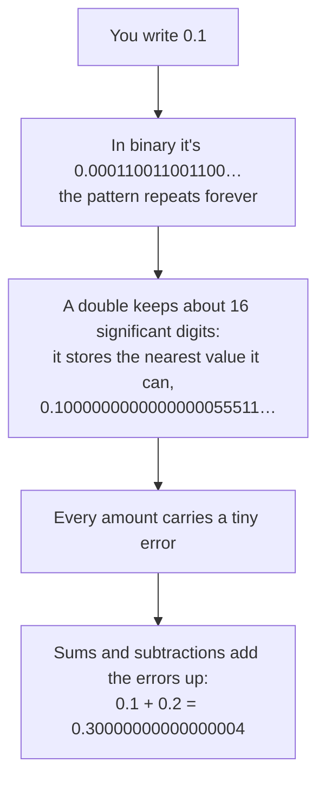
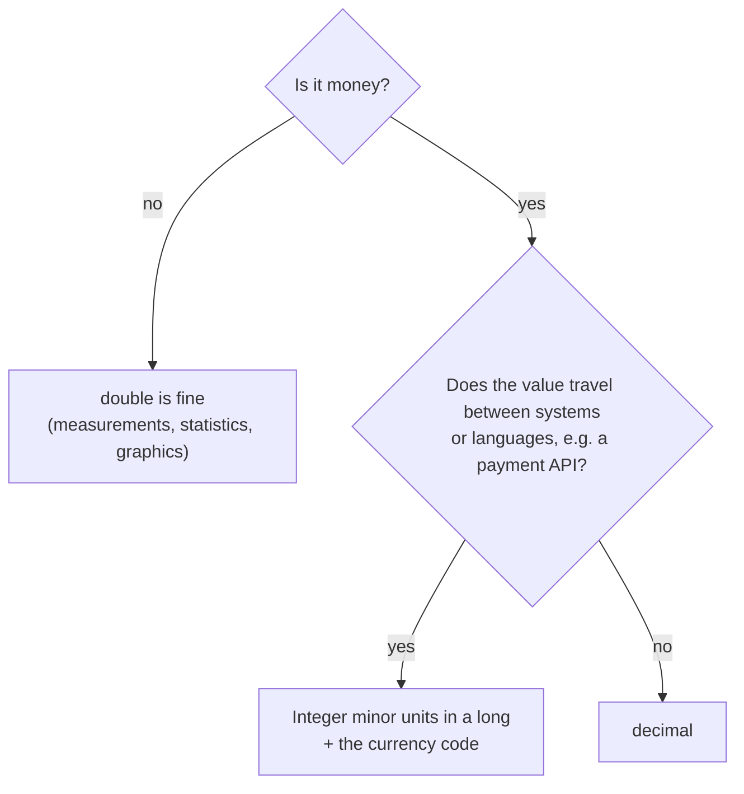
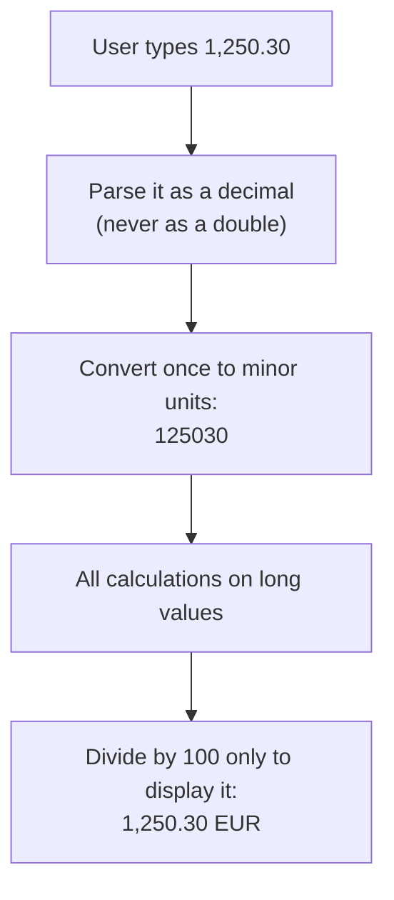
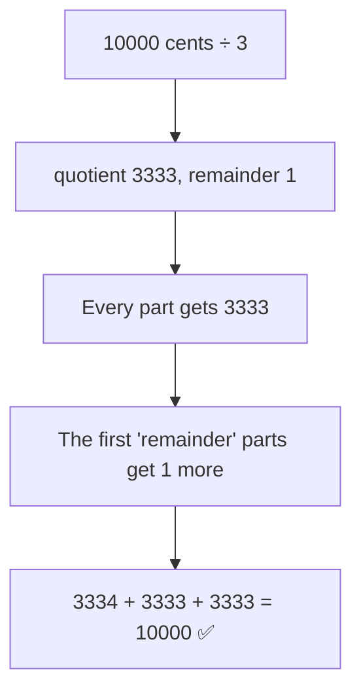
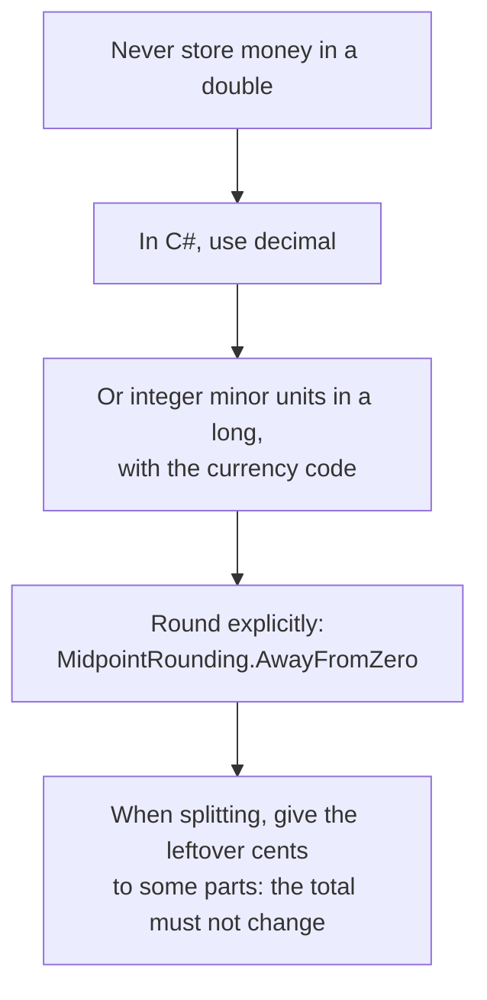

# A — Money in Code

| Referenced by | Prerequisites | Time |
|---------------|---------------|------|
| [Lesson 01 — Two Sum](../lessons/01-two-sum/README.md) | none | ~20 minutes |

**You'll learn:**

- why `0.1 + 0.2 == 0.3` is `false` with `double`, and why that breaks real code
- the three ways to store money in C#, and when to use each
- the rounding rule that surprises most developers
- how to split an amount into installments without losing a cent

---

## 1. The Bug

Take the reconciliation problem of [lesson 01](../lessons/01-two-sum/README.md), but store the amounts as `double`. A transfer of **1,250.30 EUR** pays two invoices: **820.10** and **430.20**. The algorithm computes `target − amount` and looks it up in a dictionary:

```
1250.30 − 430.20 = 820.0999999999999
```

The dictionary contains `820.1`, not `820.0999999999999`. The lookup fails, and the algorithm says **"no pair found"**, even though the pair is right there. This is real output from the [experiment](#7--try-it):

```
double:  no pair found  <-- wrong!
decimal: found positions 2 and 4
cents:   found positions 2 and 4
```

No exception, no warning: just a wrong answer.

---

## 2. Why: Base 2 Can't Write 0.1

You know that 1/3 can't be written exactly in base 10: `0.3333…` goes on forever, and any finite number of digits is an approximation.

A `double` stores numbers **in base 2**, and in base 2 the same thing happens to 0.1:



When you print a `double`, .NET shows the shortest text that identifies it, so most of the time you see `0.1` and never notice. The error only shows up when you **compare** or **accumulate**:

```csharp
Console.WriteLine(0.1 + 0.2 == 0.3);   // False

double total = 0;
for (var i = 0; i < 10; i++) total += 0.10;
Console.WriteLine(total);              // 0.9999999999999999
```

### ⏸️ Pause and think

Which of these values can a `double` store **exactly**: 0.5, 0.25, 0.1, 0.75?

<details>
<summary>Answer</summary>

**0.5, 0.25 and 0.75.** They are sums of halves, quarters, eighths… (0.75 = 1/2 + 1/4), which are exactly the fractions base 2 can write. 0.1 = 1/10 needs a factor of 5 that base 2 doesn't have, so it becomes an infinite pattern.

</details>

📌 **In a nutshell:** `double` is not *imprecise*; it's *binary*. Most decimal amounts simply don't exist in binary.

---

## 3. The Three Options

| | `double` | `decimal` | Integer minor units (`long`) |
|---|---|---|---|
| Example | `1250.30` | `1250.30m` | `125030` (cents) |
| Base | 2 | 10 | integer |
| `0.10 + 0.20 == 0.30` | ❌ false | ✅ true | ✅ `10 + 20 == 30` |
| Speed | fast | slower (still fast enough for business code) | fast |
| Typical use | science, graphics, statistics | business code in .NET, database `decimal` columns | payment APIs, cross-language systems, algorithms |



---

## 4. `decimal`: Exact for Decimal Fractions

`decimal` stores numbers **in base 10**, with 28–29 significant digits. Amounts like 0.10 or 1,250.30 are stored exactly, so sums and comparisons behave as you expect.

It's not magic, though:

- **Division can still be inexact:** `1m / 3m` is `0.3333333333333333333333333333`. When you divide money, *you* decide how to round, and where the leftover goes (see [section 6](#6-splitting-money-without-losing-a-cent)).
- **The default rounding is not the one from school.**

### The rounding surprise

```csharp
Math.Round(2.5m)                                    // 2   (!)
Math.Round(3.5m)                                    // 4
Math.Round(2.5m, MidpointRounding.AwayFromZero)     // 3
```

By default, `Math.Round` uses **round half to even** (also called *banker's rounding*): a value exactly halfway goes to the nearest **even** number. Over many operations it avoids a systematic upward bias. But most invoices and business rules expect **half away from zero** (2.5 → 3), so pass `MidpointRounding.AwayFromZero` explicitly, and check the rules of your country and domain.

### ⏸️ Pause and think

What's `Math.Round(0.125m, 2)`? And with `MidpointRounding.AwayFromZero`?

<details>
<summary>Answer</summary>

**0.12** by default: 0.125 is exactly halfway between 0.12 and 0.13, and 2 is the even digit. With `AwayFromZero` it's **0.13**.

</details>

---

## 5. Integer Minor Units

The other approach avoids fractions entirely: store the amount as an integer number of the **smallest unit of the currency** (the *minor unit*): 1,250.30 EUR becomes `125030` cents. Integer arithmetic is exact and fast, and integers look the same in every language and database, which is why many payment APIs exchange amounts this way.



Two things to watch:

| Watch out for | Why | What to do |
|---------------|-----|------------|
| **Not every currency has 2 decimals** | The ISO 4217 standard defines the minor units of each currency: EUR has 2, the Japanese yen (JPY) has 0, the Kuwaiti dinar (KWD) has 3 | Always store the **currency code** with the amount, and convert using its number of decimals |
| **Overflow** | An `int` holds at most 2,147,483,647 cents, about **21.5 million EUR**: a single large invoice or a yearly total can exceed it | Use `long` (up to about 92 quadrillion EUR in cents) |

> [!NOTE]
> Lesson 01 uses `int` cents to keep the code close to the classic interview problem, and computes every sum in `long` to avoid overflow. In production code, store the amounts themselves as `long`.

---

## 6. Splitting Money Without Losing a Cent

A customer pays **100.00 EUR in 3 installments**. The obvious code:

```csharp
var installment = Math.Round(100.00m / 3, 2);   // 33.33
var total = installment * 3;                    // 99.99: one cent is gone
```

Rounding each part independently loses (or creates) cents. The fix is to work in minor units, divide with remainder, and **give the leftover units to some of the parts**:



That's [MoneyAllocation.Split](../src/Algorithms/Appendix/MoneyAllocation.cs). Its [tests](../tests/Algorithms.Tests/Appendix/MoneyAllocationTests.cs) check, on 1,000 random cases, that the parts **always add up to the total** and **differ by at most one cent**. It also works for negative amounts, such as a refund split across installments.

### ⏸️ Pause and think

How does `Split` divide **0.10 EUR among 3 people**?

<details>
<summary>Answer</summary>

10 cents ÷ 3 = 3 with remainder 1, so **4 + 3 + 3 cents**: 0.04, 0.03, 0.03 EUR. Someone has to get the extra cent; the important thing is that the total is still exactly 0.10.

</details>

---

## 7. 🧪 Try It

The [MoneyExperiment](../experiments/MoneyExperiment/Program.cs) project runs everything shown in this appendix:

```bash
dotnet run --project experiments/MoneyExperiment
```

```
1. A simple sum
   double:  0.1 + 0.2 = 0.30000000000000004   equals 0.3? False
   decimal: 0.1 + 0.2 = 0.3                 equals 0.3? True

2. Adding 0.10 EUR ten times
   double:  0.9999999999999999   equals 1.00? False
   decimal: 1.00                 equals 1.00? True
   cents:   100                   equals 100?  True

3. Two Sum: which two invoices does a 1,250.30 EUR transfer pay?
   Invoices: 310.00, 475.00, 820.10, 155.00, 430.20 (the answer is 820.10 + 430.20)
   double:  no pair found  <-- wrong!
   decimal: found positions 2 and 4
   cents:   found positions 2 and 4
   (with doubles, 1250.30 - 430.20 = 820.0999999999999, not 820.10)

4. Rounding half-way values
   Math.Round(2.5m) = 2   Math.Round(3.5m) = 4   (to even: the default)
   Math.Round(2.5m, MidpointRounding.AwayFromZero) = 3

5. Splitting 100.00 EUR into 3 installments
   naive:  3 x 33.33 = 99.99   (one cent lost)
   Split:  33.34 + 33.33 + 33.33 = 100.00
```

---

## 🧠 Quick Check

**1.** You're adding a `Price` property to a C# entity saved in SQL Server. Which type?

<details>
<summary>Answer</summary>

**`decimal`**, mapped to a `decimal(18, 2)` (or similar) column. Or a `long` in minor units, if the system already works that way. Never `double` or `float`.

</details>

**2.** Why is `Dictionary<double, int>` a bad idea for looking up amounts?

<details>
<summary>Answer</summary>

Dictionary lookups need **exact equality**. Two `double` values that "should" be equal (like `1250.30 − 430.20` and `820.10`) can differ in the last binary digit, so the lookup misses.

</details>

**3.** How does `MoneyAllocation.Split` divide **1,000.00 EUR into 7 installments**?

<details>
<summary>Answer</summary>

100,000 cents ÷ 7 = 14,285 with remainder 5: the first **5** installments are **142.86 EUR** and the last **2** are **142.85 EUR**. Check: 5 × 142.86 + 2 × 142.85 = 714.30 + 285.70 = 1,000.00.

</details>

---

## 📌 Summary



[← Back to the appendix index](README.md)
