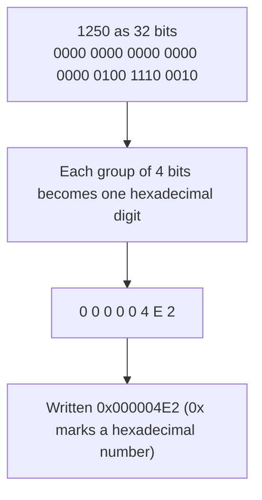
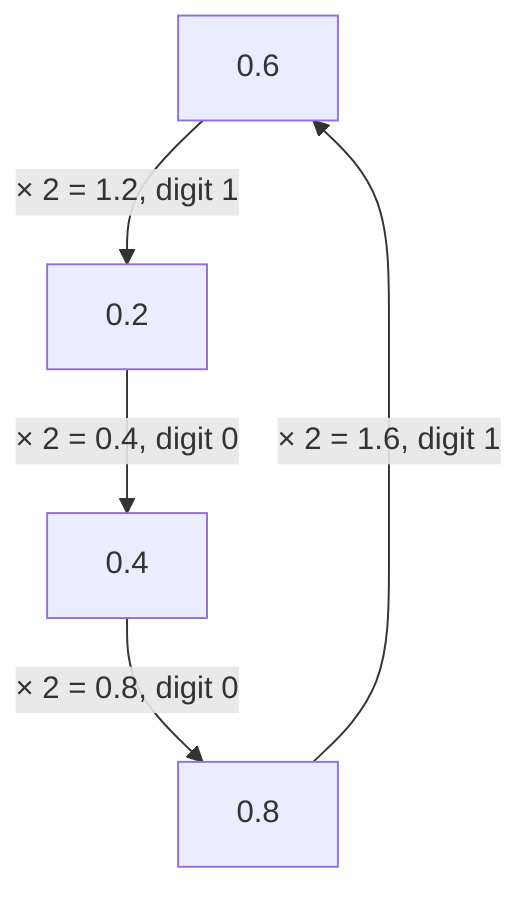
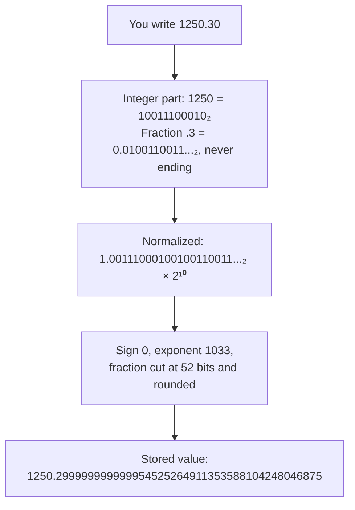
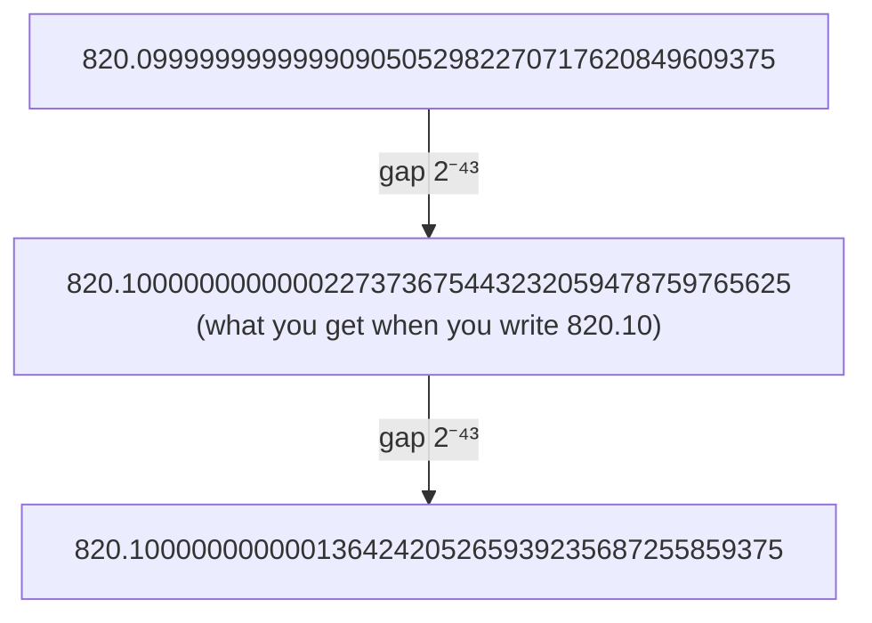
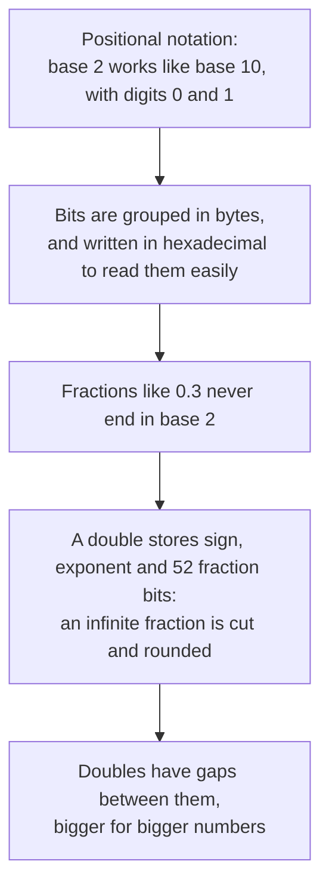

# Appendix A: Numbers in binary

| Prerequisites | Time |
|---------------|------|
| none | about 30 minutes |

Computers store every number as a sequence of 0s and 1s. This appendix starts from the way we already write numbers and builds up, one step at a time, to how a `double` is stored and why some numbers can't be stored exactly.

## 1. What a digit is worth depends on where it is

When you read 1250, you don't just see four digits: you know that the 1 is worth a thousand, the 2 two hundred, the 5 fifty. Each position is worth ten times the position on its right.

| Position value | 1000 (10³) | 100 (10²) | 10 (10¹) | 1 (10⁰) |
|---|---:|---:|---:|---:|
| Digit | 1 | 2 | 5 | 0 |
| Contribution | 1000 | 200 | 50 | 0 |

1250 = 1000 + 200 + 50 + 0. This way of writing numbers is called positional notation, and the "ten" behind it is the base.

Where do the position values come from? From counting. In base 10 the rightmost digit counts the units. When it goes past 9 there's no digit left, so it goes back to 0 and the digit on its left grows by one: 9 + 1 = 10. That second digit therefore counts groups of ten. When it goes past 9 too, the third digit starts counting groups of ten tens, that is a hundred. That's why the positions are worth 1, 10, 100, 1000: each one is ten times the previous one, because it takes ten of the previous kind to fill it.

Nothing forces the base to be ten. Base 2 counts in exactly the same way, but it has only two digits, 0 and 1, so it runs out of digits much sooner, right after 1:

| In base 10 | In base 2 | What happens |
|---:|---:|---|
| 0 | 0 | |
| 1 | 1 | the rightmost digit is full: 1 is the last digit available |
| 2 | 10 | it goes back to 0 and the next digit becomes 1: the second position counts twos |
| 3 | 11 | both digits are full |
| 4 | 100 | both go back to 0 and the third digit becomes 1: the third position counts fours |
| 5 | 101 | |
| 6 | 110 | |
| 7 | 111 | three digits full |
| 8 | 1000 | the fourth position counts eights |

So in base 2 the positions are worth 1, 2, 4, 8, 16 and so on: each one is twice the previous one, because it takes two of the previous kind to fill it.

Reading a number in base 2 works just like in base 10: multiply each digit by the value of its position, and add up.

| Position value | 8 (2³) | 4 (2²) | 2 (2¹) | 1 (2⁰) |
|---|---:|---:|---:|---:|
| Digit | 1 | 1 | 0 | 1 |
| Contribution | 8 | 4 | 0 | 1 |

So 1101 in base 2 is 8 + 4 + 0 + 1 = 13. To avoid confusion, a small 2 marks numbers written in base 2: 1101₂ = 13.

Computers use base 2 because their circuits work with two states, current or no current, which are easy to tell apart reliably. Each of these 0s and 1s is called a bit, short for binary digit.

### Stop and think

What number is 1010₂? And if you continue the counting table, how do you write 9 in base 2?

<details>
<summary>Answer</summary>

1010₂ = 8 + 0 + 2 + 0 = 10. And 9 comes right after 8 = 1000₂: the rightmost digit goes from 0 to 1, so 9 = 1001₂. One more and the rightmost digit is full again, so it goes back to 0 and the next one becomes 1: 10 = 1010₂, which matches the first answer.

</details>

## 2. From base 10 to base 2

Before converting to base 2, look at what happens when you divide 1250 by 10 in base 10: the result is 125 with a remainder of 0. The remainder is exactly the last digit of 1250, and the result is the number made of the remaining digits. Dividing by the base peels off the last digit.

The same trick works in base 2, dividing by 2. The remainder (0 or 1) is the last binary digit, and the result is the number made of the remaining binary digits. Repeat until the result is 0:

| Division | Result | Remainder |
|---|---:|---:|
| 1250 ÷ 2 | 625 | 0 |
| 625 ÷ 2 | 312 | 1 |
| 312 ÷ 2 | 156 | 0 |
| 156 ÷ 2 | 78 | 0 |
| 78 ÷ 2 | 39 | 0 |
| 39 ÷ 2 | 19 | 1 |
| 19 ÷ 2 | 9 | 1 |
| 9 ÷ 2 | 4 | 1 |
| 4 ÷ 2 | 2 | 0 |
| 2 ÷ 2 | 1 | 0 |
| 1 ÷ 2 | 0 | 1 |

The first remainder is the last digit, so the remainders are read from the bottom up: 1250 = 10011100010₂.

To check, add up the positions that hold a 1: 1024 + 128 + 64 + 32 + 2 = 1250.

You can ask C# to do the same conversion: `Convert.ToString(1250, 2)` returns `"10011100010"`.

### Stop and think

Convert 13 to base 2 with the division method. Does the result match the 1101₂ of section 1?

<details>
<summary>Answer</summary>

13 ÷ 2 = 6 remainder 1, 6 ÷ 2 = 3 remainder 0, 3 ÷ 2 = 1 remainder 1, 1 ÷ 2 = 0 remainder 1. Read from the bottom up: 1101₂, the same as section 1.

</details>

## 3. Bits, bytes and hexadecimal

A single bit can only say 0 or 1, so computers group bits together. A group of 8 bits is a byte, and with 8 bits you can write the numbers from 00000000₂ = 0 to 11111111₂ = 255. Memory is organized in bytes, and every C# type takes a fixed number of them:

| C# type | Bytes | Bits |
|---------|------:|-----:|
| `byte`  | 1     | 8    |
| `int`   | 4     | 32   |
| `long`  | 8     | 64   |
| `double`| 8     | 64   |
| `decimal` | 16  | 128  |

An `int` always uses all its 32 bits, so 1250 is stored with zeros in front of it:

```
00000000 00000000 00000100 11100010
```

Long rows of 0s and 1s are hard to read, which is why programmers often write them in base 16, called hexadecimal. Base 16 needs sixteen digits: after 0 to 9 come the letters A (10), B (11), C (12), D (13), E (14) and F (15). Since 16 = 2⁴, every hexadecimal digit stands for exactly 4 bits, so converting is just a matter of splitting the bits into groups of four:



In C#, `$"{1250:X8}"` gives `"000004E2"`, and `Convert.ToString(1250, 16)` gives `"4e2"`. Appendix B uses hexadecimal to show what's really in memory.

### Stop and think

What number is 0xFF, and why does it fit exactly in one byte?

<details>
<summary>Answer</summary>

F is 15, so 0xFF = 15 × 16 + 15 = 255. Each F is four bits set to 1, so 0xFF is 11111111₂: the largest number a byte can hold.

</details>

## 4. Fractions in binary

The positions after the point follow the same rule as the ones before it, divided by the base at every step. In base 10, the positions after the point are worth a tenth, a hundredth, a thousandth. In base 2 they're worth a half, a quarter, an eighth, and so on:

| Position value | 1/2 = 0.5 | 1/4 = 0.25 | 1/8 = 0.125 |
|---|---:|---:|---:|
| Digit | 1 | 0 | 1 |
| Contribution | 0.5 | 0 | 0.125 |

So 0.101₂ = 0.5 + 0 + 0.125 = 0.625.

To go the other way, from a base 10 fraction to binary, you multiply by 2. Multiplying by 2 shifts the binary point one place to the right, so the digit that crosses the point and becomes the integer part is exactly the first binary digit after the point. You write that digit down, keep only the part after the point, and repeat. For 0.625 it ends after three steps:

| Step | Calculation | Digit (integer part) | Continue with |
|---|---|---:|---|
| 1 | 0.625 × 2 = 1.25 | 1 | 0.25 |
| 2 | 0.25 × 2 = 0.5 | 0 | 0.5 |
| 3 | 0.5 × 2 = 1.0 | 1 | 0, done |

Reading the digits from the top down gives 0.625 = 0.101₂, the same as the table above.

Now try 0.3:

| Step | Calculation | Digit (integer part) | Continue with |
|---|---|---:|---|
| 1 | 0.3 × 2 = 0.6 | 0 | 0.6 |
| 2 | 0.6 × 2 = 1.2 | 1 | 0.2 |
| 3 | 0.2 × 2 = 0.4 | 0 | 0.4 |
| 4 | 0.4 × 2 = 0.8 | 0 | 0.8 |
| 5 | 0.8 × 2 = 1.6 | 1 | 0.6 |
| 6 | 0.6 × 2 = 1.2 | 1 | 0.2 |

Reading the digits from the top down gives 0.3 = 0.010011...₂, and the calculation is not finished.

At step 5 we continue with 0.6, the same value we had at step 2. From there the calculations repeat identically: step 6 is the same as step 2, step 7 the same as step 3, and so on forever. That's why the digits 1001 of steps 2 to 5 repeat without end: 0.3 = 0.0100110011001...₂. The process never reaches 0, so 0.3 can't be written in binary with a finite number of digits.



The same happens to 0.2 and to 0.1, which are part of the same loop. The rule behind it: a fraction has a finite binary form only if, reduced to its lowest terms, its denominator is a power of 2. 0.625 is 5/8 and 8 = 2³, so it's finite. 0.3 is 3/10, and 10 = 2 × 5 contains a factor of 5 that base 2 can't produce, so it's infinite. It's the same reason why 1/3 = 0.333... never ends in base 10.

### Stop and think

Which of these can be written in binary with a finite number of digits: 0.75, 0.1, 0.375?

<details>
<summary>Answer</summary>

0.75 = 3/4 = 0.11₂ and 0.375 = 3/8 = 0.011₂ are finite, because 4 and 8 are powers of 2. 0.1 = 1/10 is infinite.

</details>

## 5. How a double is built

In base 10, scientific notation writes a number as one digit before the point, multiplied by a power of 10: 1250.3 = 1.2503 × 10³. The same idea works in base 2, where the digit before the point can only be 1:

```
1250.3 = 10011100010.0100110011...₂ = 1.00111000100100110011...₂ × 2¹⁰
```

Moving the point 10 places to the left means multiplying by 2¹⁰ to keep the same value. A `double` stores exactly this form, using its 64 bits for three pieces of information:

| Part | Bits | What it stores | For 1250.30 |
|------|-----:|----------------|-------------|
| Sign | 1 | 0 for positive, 1 for negative | `0` |
| Exponent | 11 | the power of 2, plus 1023 | 10 + 1023 = 1033 = `10000001001` |
| Fraction | 52 | the digits after "1.", cut at 52 | `0011100010` `010011001100...0011` |

A few details deserve an explanation.

The 1 before the point isn't stored at all. In base 2 every number except 0 starts with 1 in this form, so storing it would waste a bit; the processor adds it back when it reads the number.

The exponent is stored with 1023 added to it, so that negative exponents can be written without a sign. 0.1 is 1.6 × 2⁻⁴, and its stored exponent is -4 + 1023 = 1019.

The fraction is where the trouble starts. The first 10 of its 52 bits hold the rest of the integer part (`0011100010`, the digits of 1250 after the first 1), and only the remaining 42 bits are left for .3. As we saw in section 4, .3 needs infinitely many bits, so the pattern is cut after 42 of them. The first bit that doesn't fit is a 0, so the cut rounds down, and the double stores a value slightly smaller than 1250.30:



These are the 64 bits really stored for 1250.30, split into the three parts:

```
0 10000001001 0011100010010011001100110011001100110011001100110011
sign exponent fraction
```

In hexadecimal they are `0x4093893333333333`: the repeated 3s are the 0011 pattern of .3.

### Stop and think

Why does the exponent field store the exponent plus 1023, instead of the exponent itself?

<details>
<summary>Answer</summary>

So that numbers smaller than 1, which have a negative exponent, can be stored without a separate sign for the exponent. With the 1023 offset, the exponents from -1022 to 1023 become positive numbers from 1 to 2046. (The values 0 and 2047 are reserved for special cases such as zero, infinity and NaN.)

</details>

## 6. The gaps between doubles

A `double` has only 52 bits for the fraction, so it can't represent every number: between two consecutive doubles there's a gap, and no double exists inside it. The size of the gap depends on how big the number is, because the integer part and the part after the point share the same 52 bits. The bigger the integer part, the fewer bits are left after the point.

| Number | Integer part in binary | Bits used by the integer part | Bits left after the point | Gap to the next double |
|-------:|------------------------|------:|------:|------------------------|
| 430.20 | 110101110 | 8 | 44 | 2⁻⁴⁴, about 0.0000000000000568 |
| 820.10 | 1100110100 | 9 | 43 | 2⁻⁴³, about 0.0000000000001137 |
| 1250.30 | 10011100010 | 10 | 42 | 2⁻⁴², about 0.0000000000002274 |
| 1,000,000 | 11110100001001000000 | 19 | 33 | 2⁻³³, about 0.0000000001164 |

The first 1 of the integer part is the hidden bit and isn't counted. This is why the precision of a `double` is often described as "about 15 to 17 significant digits": the digits are shared between the part before and the part after the point.

Around 820 the doubles closest to 820.10 are these three, and nothing exists in between:



When a calculation produces a result that falls inside a gap, the processor has to round it to one of the two doubles around it. That's exactly what happens to `1250.30 - 430.20`, and appendix B follows that subtraction bit by bit.

### Stop and think

The gap grows with the size of the number. What happens above 2⁵³, about 9 million billion?

<details>
<summary>Answer</summary>

There are no bits left after the point, and the gap becomes 2: not even every integer can be stored. In C#, `(double)9_007_199_254_740_993L` gives 9007199254740992, because 2⁵³ + 1 falls between two doubles. That's one reason why large identifiers and amounts in cents should be stored as `long`, not as `double`.

</details>

## 7. Try it

The [InspectDouble](../experiments/InspectDouble/Program.cs) project shows how any number is stored. Without arguments it inspects the numbers used in this appendix:

```bash
dotnet run --project experiments/InspectDouble
dotnet run --project experiments/InspectDouble -- 0.3 2.75
```

This is its output for 1250.30:

```
You wrote:   1250.3
  bits:      0 10000001001 0011100010010011001100110011001100110011001100110011
             s exponent    fraction (52 bits)
  hex:       0x4093893333333333
  exponent:  10
  stored:    1250.299999999999954525264911353588104248046875
  next gap:  2.27374E-13
```

It uses [DoubleInspector](../src/Algorithms/Appendix/DoubleInspector.cs), and its [tests](../tests/Algorithms.Tests/Appendix/DoubleInspectorTests.cs) check every number quoted in this appendix.

## Quick check

**1.** What number is 1111₂?

<details>
<summary>Answer</summary>

8 + 4 + 2 + 1 = 15.

</details>

**2.** How many hexadecimal digits do you need to write the 8 bytes of a `double`?

<details>
<summary>Answer</summary>

16: each byte is 8 bits, and each hexadecimal digit covers 4 bits, so two digits per byte.

</details>

**3.** Can a `double` store 0.375 exactly? And 0.3?

<details>
<summary>Answer</summary>

0.375 = 3/8 = 0.011₂ has a finite binary form, so yes. 0.3 = 3/10 has an infinite binary form, so the double stores the closest value it can.

</details>

**4.** Why is the gap between doubles bigger around 1,000,000 than around 1?

<details>
<summary>Answer</summary>

The integer part of 1,000,000 takes 19 of the 52 fraction bits, leaving fewer bits for the digits after the point. Around 1 almost all 52 bits are available after the point.

</details>

## Summary



[Back to the appendix index](README.md)
