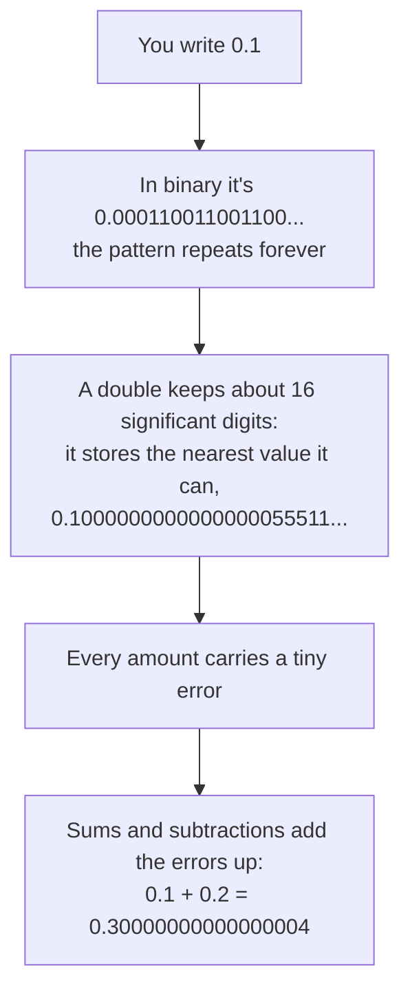
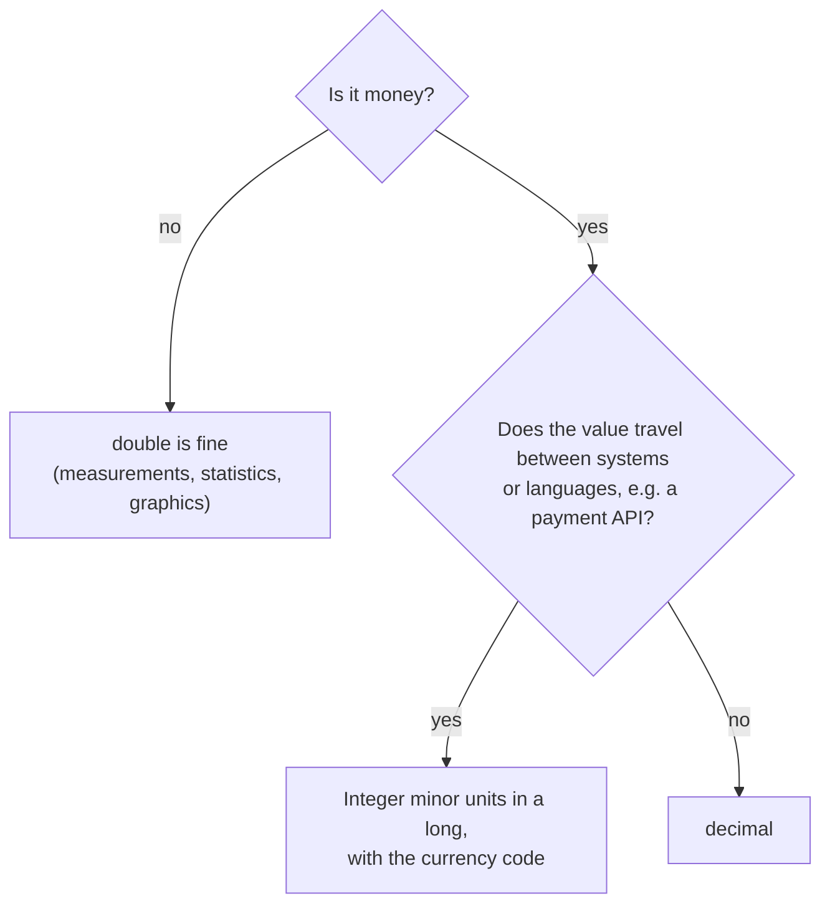
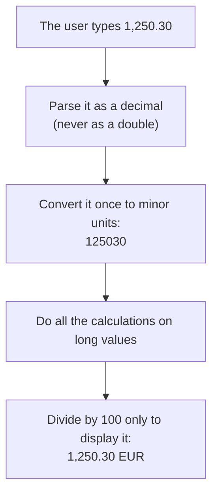
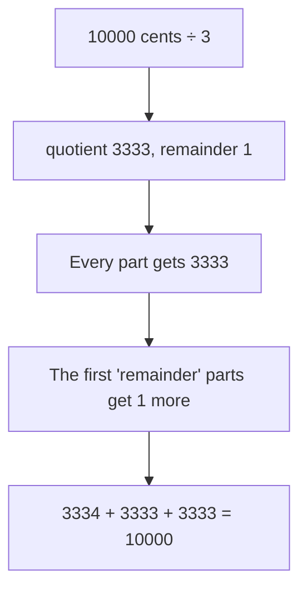
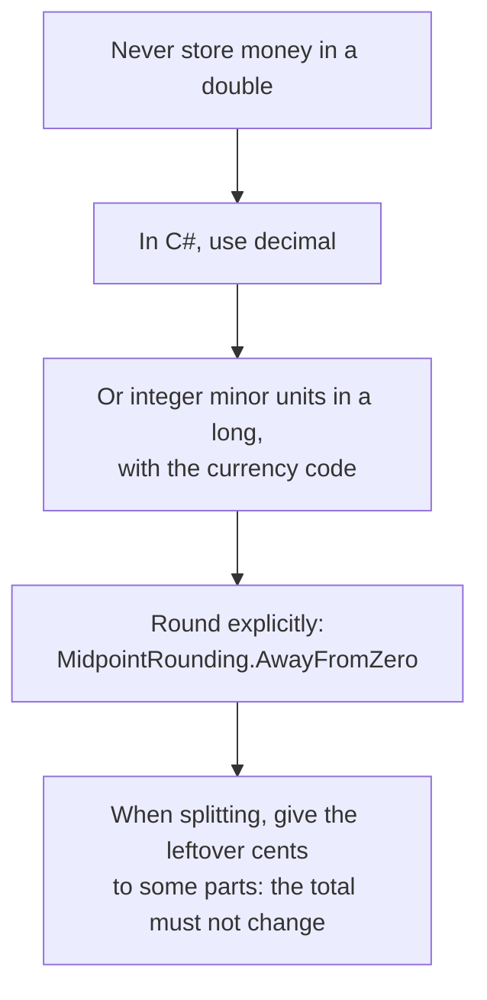

# Appendix C: Money in code

| Referenced by | Prerequisites | Time |
|---------------|---------------|------|
| [Lesson 01](../lessons/01-two-sum/README.md) | none | about 20 minutes |

This appendix explains why `0.1 + 0.2 == 0.3` is false with `double`, and why that breaks real code. We'll compare the three ways to store money in C# and when to use each one, look at the rounding rule that surprises most developers, and see how to split an amount into installments without losing a cent.

## 1. The bug

Take the reconciliation problem of [lesson 01](../lessons/01-two-sum/README.md), but store the amounts as `double`. A transfer of 1,250.30 EUR pays two invoices, one of 820.10 and one of 430.20. The algorithm computes `target - amount` and looks the result up in a dictionary:

```
1250.30 - 430.20 = 820.0999999999999
```

The dictionary contains `820.1`, not `820.0999999999999`. The lookup fails and the algorithm says there's no pair, even though the pair is right there. This is the real output of the [experiment](#7-try-it):

```
double:  no pair found  <-- wrong!
decimal: found positions 2 and 4
cents:   found positions 2 and 4
```

There's no exception and no warning, just a wrong answer.

## 2. Why: base 2 can't write 0.1

This section gives the short version. [Appendix A](A-numbers-in-binary.md) explains it from the beginning, starting from how numbers are written in base 2, up to how the 64 bits of a `double` are used.

You know that 1/3 can't be written exactly in base 10: `0.3333...` goes on forever, and any finite number of digits is only an approximation.

A `double` stores numbers in base 2, and in base 2 the same thing happens to 0.1:



When you print a `double`, .NET shows the shortest text that identifies it, so most of the time you see `0.1` and never notice anything. The error only shows up when you compare or accumulate values:

```csharp
Console.WriteLine(0.1 + 0.2 == 0.3);   // False

double total = 0;
for (var i = 0; i < 10; i++) total += 0.10;
Console.WriteLine(total);              // 0.9999999999999999
```

### Stop and think

Which of these values can a `double` store exactly: 0.5, 0.25, 0.1, 0.75?

<details>
<summary>Answer</summary>

0.5, 0.25 and 0.75. They're sums of halves, quarters, eighths and so on (0.75 = 1/2 + 1/4), which are exactly the fractions base 2 can write. 0.1 is 1/10, which needs a factor of 5 that base 2 doesn't have, so it becomes an infinite pattern.

</details>

In short: a `double` isn't imprecise, it's binary, and most decimal amounts simply don't exist in binary.

## 3. The three options

| | `double` | `decimal` | Integer minor units (`long`) |
|---|---|---|---|
| Example | `1250.30` | `1250.30m` | `125030` (cents) |
| Base | 2 | 10 | integer |
| `0.10 + 0.20 == 0.30` | false | true | true (`10 + 20 == 30`) |
| Speed | fast | slower, but fast enough for business code | fast |
| Typical use | science, graphics, statistics | business code in .NET, `decimal` database columns | payment APIs, systems written in several languages, algorithms |



## 4. `decimal`: exact for decimal fractions

`decimal` stores numbers in base 10, with 28 or 29 significant digits. Amounts like 0.10 or 1,250.30 are stored exactly, so sums and comparisons behave as you'd expect.

It isn't magic, though. Divisions can still be inexact: `1m / 3m` is `0.3333333333333333333333333333`, so when you divide money it's up to you to decide how to round and where the leftover goes (we'll see how in [section 6](#6-splitting-money-without-losing-a-cent)). And the default rounding isn't the one you learned at school.

### The rounding surprise

```csharp
Math.Round(2.5m)                                    // 2, not 3
Math.Round(3.5m)                                    // 4
Math.Round(2.5m, MidpointRounding.AwayFromZero)     // 3
```

By default `Math.Round` uses "round half to even", also called banker's rounding: a value exactly halfway goes to the nearest even number. Over many operations this avoids a systematic upward bias. Most invoices and business rules, however, expect "half away from zero" (2.5 becomes 3), so pass `MidpointRounding.AwayFromZero` explicitly and check the rules of your country and domain.

### Stop and think

What's `Math.Round(0.125m, 2)`? And with `MidpointRounding.AwayFromZero`?

<details>
<summary>Answer</summary>

0.12 by default: 0.125 is exactly halfway between 0.12 and 0.13, and 2 is the even digit. With `AwayFromZero` it's 0.13.

</details>

## 5. Integer minor units

The other approach avoids fractions entirely: you store the amount as a whole number of the smallest unit of the currency, its minor unit. So 1,250.30 EUR becomes `125030` cents. Integer arithmetic is exact and fast, and integers look the same in every language and database, which is why many payment APIs exchange amounts this way.



There are two things to watch out for. The first is that not every currency has two decimals. The ISO 4217 standard defines the minor unit of each currency: the euro has 2 decimals, the Japanese yen (JPY) has none and the Kuwaiti dinar (KWD) has 3. Always store the currency code together with the amount, and convert using its number of decimals.

The second is overflow. An `int` holds at most 2,147,483,647 cents, about 21.5 million EUR, and a single large invoice or a yearly total can go beyond that. A `long` goes up to about 92 quadrillion EUR in cents.

Lesson 01 uses `int` cents to keep the code close to the classic interview problem, and computes every sum as a `long` to avoid overflow. In production code, store the amounts themselves as `long`.

## 6. Splitting money without losing a cent

A customer pays 100.00 EUR in 3 installments. The obvious code is this:

```csharp
var installment = Math.Round(100.00m / 3, 2);   // 33.33
var total = installment * 3;                    // 99.99: one cent is gone
```

Rounding each part on its own loses cents, or creates them. The fix is to work in minor units, divide with a remainder, and give the leftover units to some of the parts:



That's what [MoneyAllocation.Split](../src/Algorithms/Appendix/MoneyAllocation.cs) does. Its [tests](../tests/Algorithms.Tests/Appendix/MoneyAllocationTests.cs) check on 1,000 random cases that the parts always add up to the total and never differ by more than one cent. It also works with negative amounts, for example a refund split across installments.

### Stop and think

How does `Split` divide 0.10 EUR among 3 people?

<details>
<summary>Answer</summary>

10 cents divided by 3 is 3 with a remainder of 1, so 4 + 3 + 3 cents: 0.04, 0.03 and 0.03 EUR. Someone has to get the extra cent; what matters is that the total is still exactly 0.10.

</details>

## 7. Try it

The [MoneyExperiment](../experiments/MoneyExperiment/Program.cs) project runs everything shown in this appendix:

```bash
dotnet run --project experiments/MoneyExperiment
```

```
1. A simple sum
   double:  0.1 + 0.2 = 0.30000000000000004   equals 0.3? False
   decimal: 0.1 + 0.2 = 0.3                 equals 0.3? True

2. Adding 0.10 EUR ten times
   double:  0.9999999999999999   equals 1.00? False
   decimal: 1.00                 equals 1.00? True
   cents:   100                   equals 100?  True

3. Two Sum: which two invoices does a 1,250.30 EUR transfer pay?
   Invoices: 310.00, 475.00, 820.10, 155.00, 430.20 (the answer is 820.10 + 430.20)
   double:  no pair found  <-- wrong!
   decimal: found positions 2 and 4
   cents:   found positions 2 and 4
   (with doubles, 1250.30 - 430.20 = 820.0999999999999, not 820.10)

4. Rounding half-way values
   Math.Round(2.5m) = 2   Math.Round(3.5m) = 4   (to even: the default)
   Math.Round(2.5m, MidpointRounding.AwayFromZero) = 3

5. Splitting 100.00 EUR into 3 installments
   naive:  3 x 33.33 = 99.99   (one cent lost)
   Split:  33.34 + 33.33 + 33.33 = 100.00
```

## Quick check

**1.** You're adding a `Price` property to a C# entity saved in SQL Server. Which type would you use?

<details>
<summary>Answer</summary>

`decimal`, mapped to a `decimal(18, 2)` column or similar. A `long` in minor units also works, if the system already uses them. Never `double` or `float`.

</details>

**2.** Why is `Dictionary<double, int>` a bad idea for looking up amounts?

<details>
<summary>Answer</summary>

Dictionary lookups need exact equality. Two `double` values that should be equal, like `1250.30 - 430.20` and `820.10`, can differ in the last binary digit, and then the lookup misses.

</details>

**3.** How does `MoneyAllocation.Split` divide 1,000.00 EUR into 7 installments?

<details>
<summary>Answer</summary>

100,000 cents divided by 7 is 14,285 with a remainder of 5, so the first 5 installments are 142.86 EUR and the last 2 are 142.85 EUR. To check: 5 × 142.86 + 2 × 142.85 = 714.30 + 285.70 = 1,000.00.

</details>

## Summary



[Back to the appendix index](README.md)
