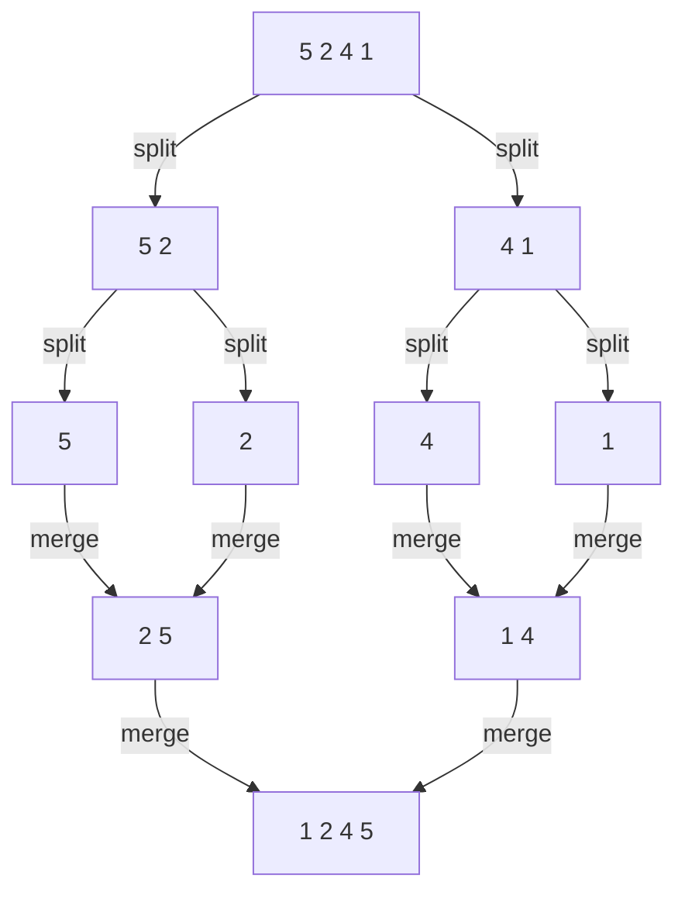
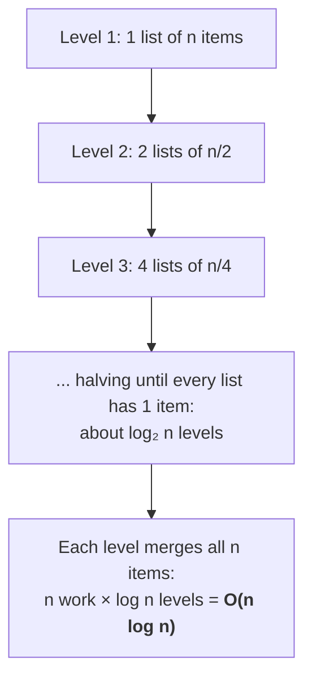
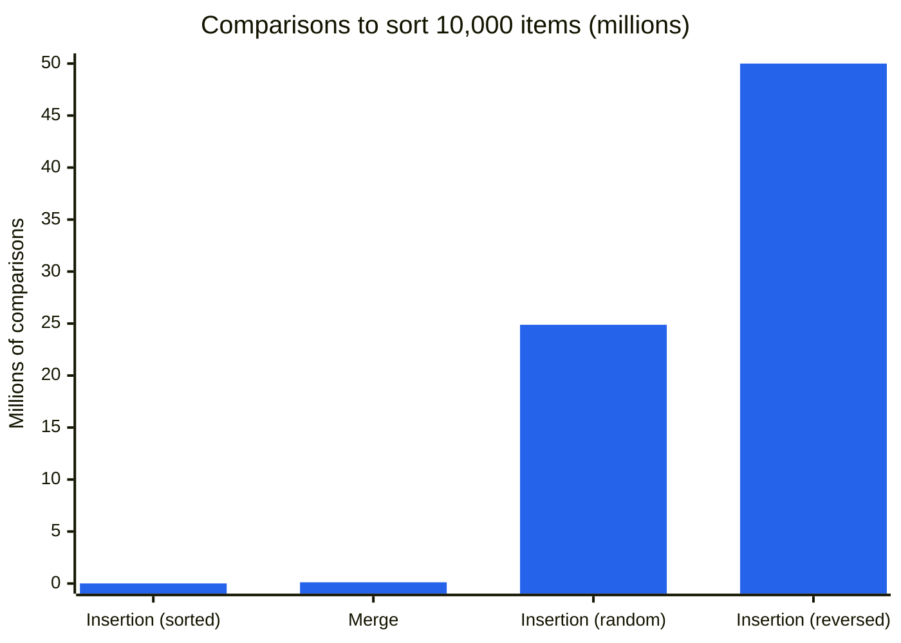
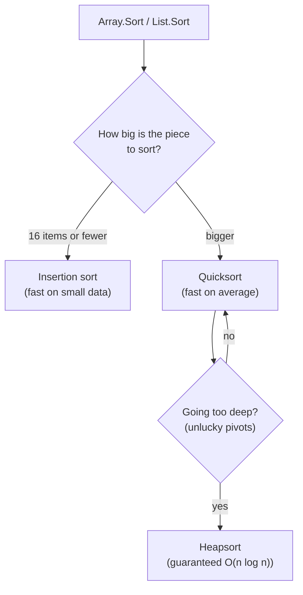
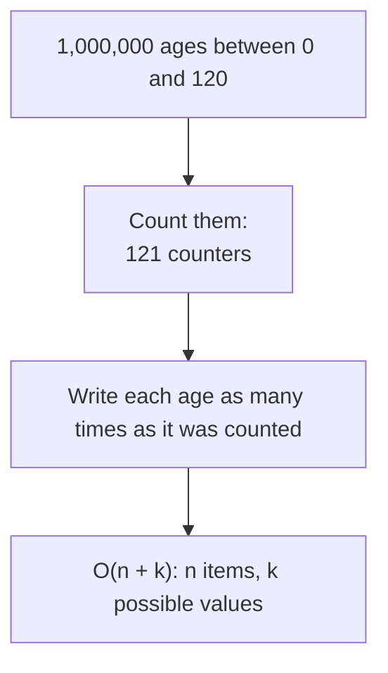
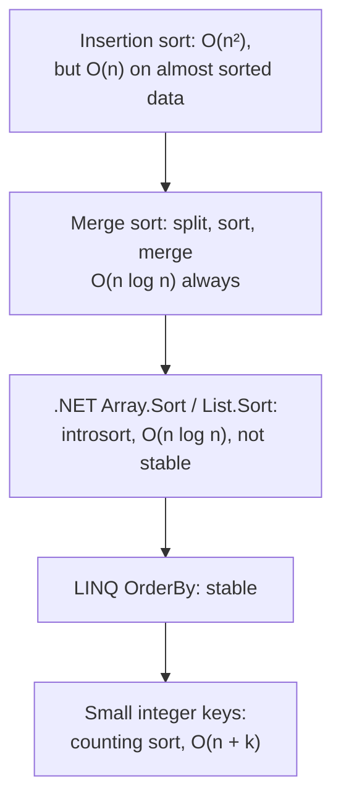

# Appendix E: How sorting works

| Referenced by | Prerequisites | Time |
|---------------|---------------|------|
| [Lesson 00](../lessons/00-big-o/README.md), [lesson 01](../lessons/01-two-sum/README.md) | [Lesson 00](../lessons/00-big-o/README.md) | about 25 minutes |

Many lessons start with "sort the data first, then...". This appendix explains what that first step costs. We'll look at a simple way to sort, insertion sort, and see why it's O(n²). Then we'll see the divide and conquer idea behind merge sort and where its n log n comes from, what .NET really uses when you call `Array.Sort` or `OrderBy`, and when you can sort even faster than n log n.

## 1. The simple way: insertion sort

Think of how you sort playing cards in your hand: you pick up one card at a time and slide it into place among the cards you're already holding.

```csharp
for (var i = 1; i < items.Length; i++)
{
    var current = items[i];
    var j = i - 1;
    while (j >= 0 && items[j] > current)    // shift the bigger cards to the right
    {
        items[j + 1] = items[j];
        j--;
    }
    items[j + 1] = current;                 // drop the card into the gap
}
```

Here's the trace on `[5, 2, 4, 1]`. The part before the `|` is already sorted:

| Step | Card picked | Hand after the step | Comparisons |
|-----:|------------:|---------------------|------------:|
| start |  | `5 \| 2 4 1` |  |
| 1 | 2 | `2 5 \| 4 1` | 1 |
| 2 | 4 | `2 4 5 \| 1` | 2 |
| 3 | 1 | `1 2 4 5` | 3 |

The last card, `1`, had to slide past every card in the hand. In the worst case, with reversed input, every new card does the same, so the comparisons are 1 + 2 + 3 + ... + (n - 1), about n²/2. That's O(n²).

### Stop and think

What happens if the input is already sorted?

<details>
<summary>Answer</summary>

Each new card is compared once with the last card in the hand, turns out to be in the right place already, and stops there: n - 1 comparisons, so O(n). Insertion sort is very fast on data that's almost sorted, which is why real sorting algorithms still use it for small pieces of data.

</details>

The code is in [SortingExamples.cs](../src/Algorithms/Appendix/SortingExamples.cs). Like the examples in the lessons, it also returns the number of comparisons it made.

## 2. Divide and conquer: merge sort

Merge sort follows a completely different idea. It splits the list in two halves and sorts each half in the same way, splitting again and again until every piece has a single item (a single item is always sorted). Then it merges the sorted pieces back together.



Merging is the clever part. Both halves are already sorted, so the smallest remaining item is always at the front of one of them: you compare the two fronts, take the smaller one and repeat. Merging two halves with `n` items in total takes about `n` steps.

### Where n log n comes from



It's the same halving you saw in [binary search](../lessons/00-big-o/README.md#3-a-smarter-search-olog-n): `n` can only be halved about log₂ n times.

### Stop and think

How many levels of splitting does merge sort need for 1,000,000 items?

<details>
<summary>Answer</summary>

About 20, because 2²⁰ is about 1,000,000. With about a million merge steps per level, that's around 20 million steps in total, compared with about 500 billion in the worst case of insertion sort.

</details>

## 3. The difference in numbers

The [SortingExperiment](../experiments/SortingExperiment/Program.cs) project counts the comparisons of both algorithms:

```bash
dotnet run -c Release --project experiments/SortingExperiment
```

| Random input, n | Insertion sort | Merge sort |
|----------------:|---------------:|-----------:|
| 100             | 2,485          | 542        |
| 1,000           | 250,194        | 8,701      |
| 10,000          | 24,882,185     | 120,492    |



The cost of insertion sort depends a lot on the input: 9,999 comparisons if it's already sorted, almost 50 million if it's reversed. Merge sort does about the same work whatever the input looks like.

## 4. Quicksort, and what .NET really uses

You'll often hear about quicksort. It picks an item, the pivot, moves the smaller items to its left and the bigger ones to its right, then sorts the two sides in the same way. On average it's O(n log n) and very fast in practice, but with unlucky pivots it degrades to O(n²).

.NET combines the strengths of these algorithms into one, called introsort:



The result is a guaranteed O(n log n), with the speed of quicksort in the common case.

### Stable or not? It matters

A sort is stable if items with the same key keep their original order.

| Method | Algorithm | Stable? |
|--------|-----------|---------|
| `Array.Sort`, `List<T>.Sort` | introsort | no |
| `Enumerable.OrderBy` (LINQ) | stable sort | yes |

Here's why it matters. Your orders are already sorted by date, and you sort them by amount. With `OrderBy`, orders with the same amount stay in date order; with `List.Sort` they can come out in any order. If you need a specific order for ties, say so explicitly: `orders.OrderBy(o => o.Amount).ThenBy(o => o.Date)`.

In short: in everyday code, call `Sort` or `OrderBy` and you get O(n log n). Choose `OrderBy` when the order of equal items matters.

## 5. Can we sort faster than n log n?

Not by comparing items: it can be proven that any sort based only on comparisons needs about n log n comparisons in the worst case.

But if the values are small integers in a known range, you don't need to compare them at all. Say you have to sort a million customers by age, from 0 to 120: you can count how many customers have each age, then write the ages out in order.



This is counting sort. A close relative, bucket sort, is the key idea of lesson 06 on the top K frequent elements (see [Module 3](../README.md#module-3-heaps-and-priority-queues)).

## Quick check

**1.** A list of 100,000 transactions is already sorted, and a few new ones are added at the end. Which of the two algorithms in this appendix would sort it again faster?

<details>
<summary>Answer</summary>

Insertion sort. The 100,000 sorted items cost one comparison each, and only the few new ones have to slide into place, so it's close to O(n). Merge sort would still do its full O(n log n).

</details>

**2.** You sort a list of orders by amount with `List<T>.Sort`, and the orders with the same amount end up in a different order than before. Is it a bug in .NET?

<details>
<summary>Answer</summary>

No: `List<T>.Sort` isn't stable, and the documentation says so. Use `OrderBy`, which is stable, or add a tie-breaker with `ThenBy`.

</details>

**3.** What does `orders.OrderBy(o => o.Date).ToList()` cost on `n` orders?

<details>
<summary>Answer</summary>

O(n log n) time, plus O(n) memory for the new list.

</details>

## Summary



[Back to the appendix index](README.md)
