# Lesson 00: Big-O in practice

| Difficulty | Module | Time |
|------------|--------|------|
| ★☆☆ Foundation | [Module 0: Foundations](../../README.md#module-0-foundations) | about 35 minutes |

**Prerequisites:** C# loops, `List<T>`, `Dictionary<TKey, TValue>`, `HashSet<T>`.

In this lesson you'll see why "it's fast on my machine" isn't enough, and how to estimate the cost of a piece of code by counting its steps. We'll go through the six complexities used in the rest of the course, each with C# code you already write every day, and at the end you'll know how to read the complexity tables of the next lessons.

There are no formulas and no proofs here: just counting and a few pictures.

## 1. Why we need it

Here's a method you could find in any business application. It checks whether two customers registered with the same email:

```csharp
bool HasDuplicateEmails(List<Customer> customers)
{
    for (var i = 0; i < customers.Count; i++)
        for (var j = i + 1; j < customers.Count; j++)    // compare every pair of customers
            if (customers[i].Email == customers[j].Email)
                return true;

    return false;
}
```

It's short, it's correct, and with 100 customers it answers instantly. Then the company grows, and the same method starts blocking the page for minutes.

The computer didn't get slower. The amount of work grew much faster than the data, and Big-O is a way to describe exactly that: how the work grows when the input grows.

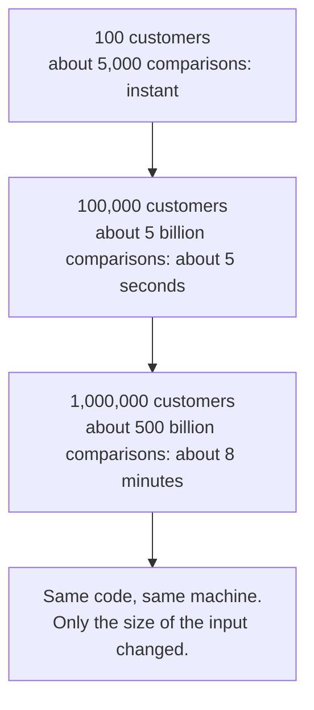

The times assume one comparison per nanosecond.

## 2. Count steps, not seconds

Seconds depend on the machine, the CPU and whatever else is running. Steps don't.

Look at what `List<int>.Contains` does when the value isn't there:

```csharp
var ids = new List<int> { 7, 3, 9, 4, 1 };
ids.Contains(8);   // compares 8 with 7, 3, 9, 4 and 1: 5 comparisons
```

There's no shortcut: it has to check every item, so with `n` items it does `n` comparisons. That's really all Big-O is about. We ask "if the input has n items, roughly how many steps?", write the answer as O(*something*) and read it as "order of *something*".

`List.Contains` is O(n): twice the items, twice the steps.

### Stop and think

A list has 1,000 items. How many comparisons does `Contains` make for a value that isn't in the list? And with 2,000 items?

<details>
<summary>Answer</summary>

1,000 and 2,000. The steps grow at the same pace as the items, which is what O(n) means.

</details>

## 3. A smarter search: O(log n)

If the list is sorted, we can do much better. Think of looking up a word in a paper dictionary: you open it in the middle, see that your word comes later, and throw away half the book. Then you do the same with the half that's left.

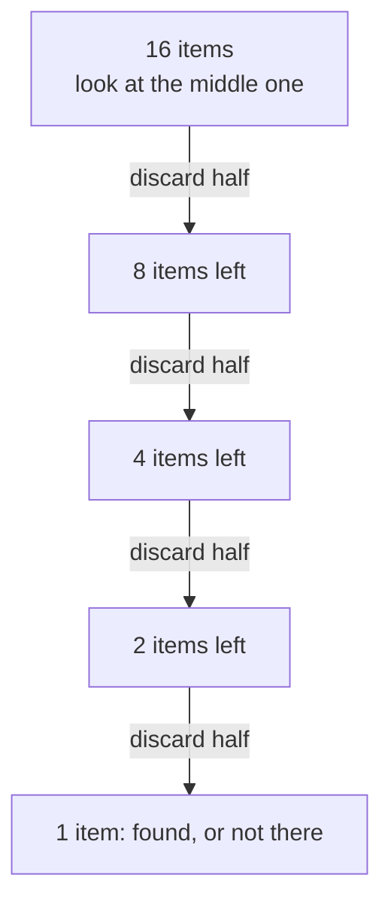

With 16 items it takes 4 or 5 steps. This is binary search, and its cost is O(log n), the number of times you can halve `n` before reaching 1.

You don't need to compute logarithms, only to remember how slowly they grow:

| Items (n) | Linear search, O(n) | Binary search, O(log n) |
|----------:|--------------------:|------------------------:|
| 10        | 10                  | 4                       |
| 1,000     | 1,000               | 10                      |
| 1,000,000 | 1,000,000           | 20                      |

The code is in [SearchExamples.cs](../../src/Algorithms/Foundations/SearchExamples.cs). Both methods return the number of steps they took, and the [tests](../../tests/Algorithms.Tests/Foundations/SearchExamplesTests.cs) check these exact numbers.

### Stop and think

How many steps does binary search need for 1 billion sorted items?

<details>
<summary>Answer</summary>

About 30. Every 10 halvings divide the size by roughly 1,000 (2¹⁰ = 1,024), so going from 1,000,000,000 to 1,000,000, then to 1,000 and finally to 1 takes 3 × 10 = 30 steps.

</details>

## 4. Six ways the work can grow

You've already met O(n) and O(log n). The course uses four more, and we'll look at them one at a time. For each one there are a few lines of C# you probably write every week, and how much work they mean for 1,000 items.

### O(1): constant

```csharp
var first = orders[0];                  // reading an array or list element by index
var customer = customersById[id];       // a Dictionary lookup (on average)
```

The work doesn't depend on the size: with 10 orders or 10 million, it's the same. For 1,000 items it takes 1 step.

### O(log n): logarithmic

```csharp
var index = sortedIds.BinarySearch(id); // halves the list at every step (section 3)
```

The work grows very slowly: about 10 steps for 1,000 items.

### O(n): linear

```csharp
decimal total = 0;
foreach (var order in orders)           // one step per order
    total += order.Amount;
```

Twice the items, twice the work: 1,000 steps for 1,000 items.

### O(n log n): linearithmic

```csharp
orders.Sort();                          // or: orders.OrderBy(o => o.Date)
```

Sorting costs a little more than reading every item once, `n` times `log n`: about 10,000 steps for 1,000 items. [Appendix G](../../appendix/G-how-sorting-works.md) explains how sorting works and why it costs exactly this much.

### O(n²): quadratic

```csharp
foreach (var a in customers)
    foreach (var b in customers)        // for each customer, look at every customer again
        Compare(a, b);
```

A loop inside a loop over the same data does `n × n` steps: 1,000,000 for 1,000 items. The `HasDuplicateEmails` method of section 1 has the same shape. It skips the pairs it has already compared, so it makes about n²/2 comparisons, but that's still O(n²), as [section 6](#6-two-rules-to-calculate-it-yourself) explains.

### O(2ⁿ): exponential

```csharp
long Fib(int n) => n < 2 ? n : Fib(n - 1) + Fib(n - 2);   // every call makes two more calls
```

Every time `n` grows by one, the work roughly doubles. It's typical of solutions that try every combination: with 1,000 items there are 2¹⁰⁰⁰ combinations, a number with 302 digits, so the program never finishes. Section 8 looks at this one in detail.

### Stop and think

Which of the six is this code?

```csharp
var romans = customers.Where(c => c.City == "Rome").ToList();
```

<details>
<summary>Answer</summary>

O(n): `Where` checks the condition once for every customer. LINQ hides the loop, but the loop is still there.

</details>

### All six together

Here they are side by side, from best to worst:

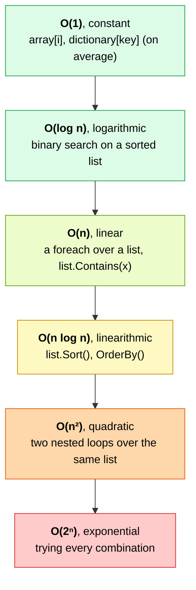

And this is what they mean in practice, if one step took a nanosecond:

| Complexity | n = 10 | n = 1,000 | n = 1,000,000 | Time for n = 1,000,000 |
|------------|-------:|----------:|--------------:|-----------------------:|
| O(1)       | 1      | 1         | 1             | instant                |
| O(log n)   | 4      | 10        | 20            | instant                |
| O(n)       | 10     | 1,000     | 1,000,000     | 1 ms                   |
| O(n log n) | 33     | 10,000    | 20,000,000    | 20 ms                  |
| O(n²)      | 100    | 1,000,000 | 10¹²          | 17 minutes             |
| O(2ⁿ)      | 1,024  | a 302-digit number | too big to write | never finishes |

With small inputs everything looks fast. Big-O matters because real data grows.

The chart below shows how quickly O(n²) runs away. The blue line is O(n) and the red one is O(n²): with only 10 items the quadratic code already does 10 times more work, and the gap keeps widening.

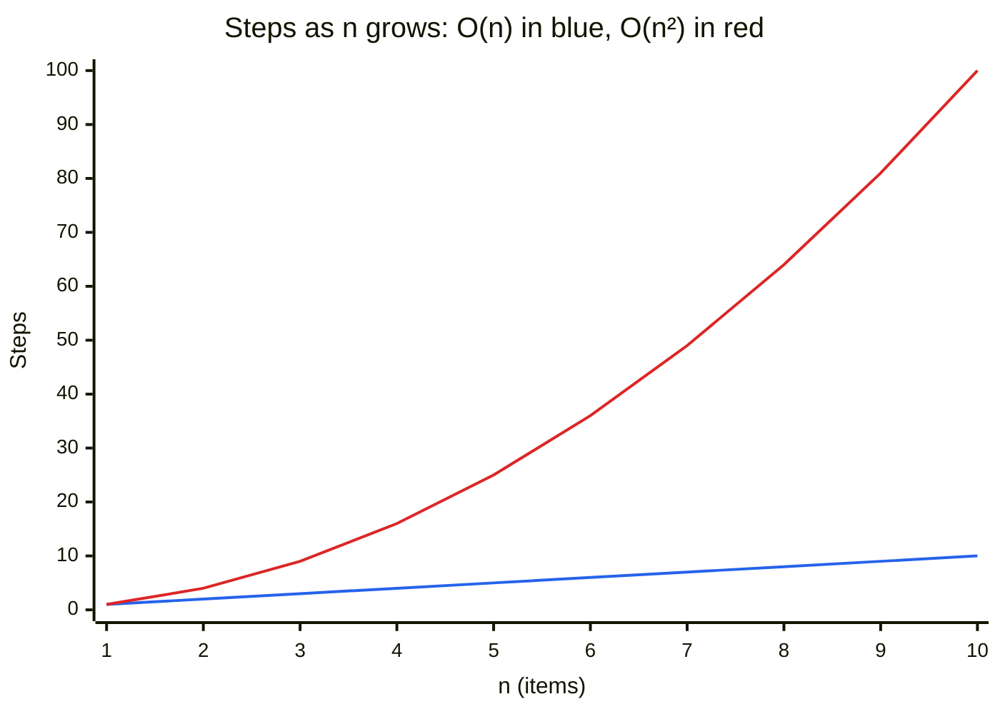

## 5. A real example: finding duplicates

Here's the same question answered in two ways (the code is in [DuplicateExamples.cs](../../src/Algorithms/Foundations/DuplicateExamples.cs)):

```csharp
// Version 1: compare every pair, O(n²)
for (var i = 0; i < items.Count; i++)
    for (var j = i + 1; j < items.Count; j++)
        if (items[i] == items[j]) return true;

// Version 2: remember what you've seen, O(n)
var seen = new HashSet<int>();
foreach (var item in items)
    if (!seen.Add(item)) return true;
```

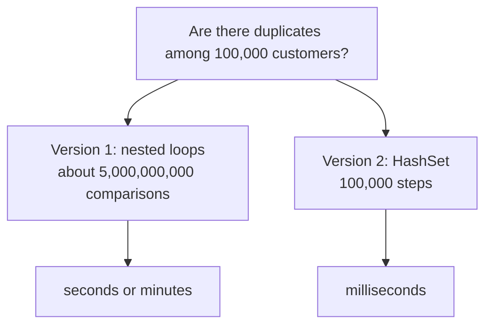

Version 2 isn't just a bit faster: it belongs to a different category, and the gap grows with every customer you add.

A loop inside a loop over the same data is the most common source of O(n²). When you see one, ask yourself whether a `HashSet` or a `Dictionary` could remember what you need.

## 6. Two rules to calculate it yourself

You don't need to count every single step. Two rules are enough.

The first rule is to drop the constants:

```csharp
foreach (var x in items) Sum(x);       // n steps
foreach (var x in items) Print(x);     // n more steps
```

That's `2n` steps, but we write O(n). Doubling the input still doubles the time, so the shape of the growth is the same.

The second rule is to keep only the biggest term:

```csharp
foreach (var x in items) Print(x);     // n steps
foreach (var x in items)
    foreach (var y in items) Compare(x, y);   // n × n steps
```

That's `n² + n` steps, but we write O(n²). With a million items, `n²` is a trillion while `n` is a million, so the second term doesn't matter.


### Stop and think

What's the complexity of this method?

```csharp
void Report(List<Order> orders)
{
    orders.Sort();                          // ?
    foreach (var order in orders)           // ?
        Console.WriteLine(order);
}
```

<details>
<summary>Answer</summary>

`Sort()` is O(n log n) and the loop is O(n). They run one after the other, so we add them: O(n log n + n). Keeping only the biggest term, it's O(n log n).

</details>

## 7. Memory counts too: space complexity

Big-O also describes how much extra memory an algorithm needs, and the two duplicate checkers make a classic trade-off:

| Version      | Time         | Extra memory | Why                            |
|--------------|--------------|--------------|--------------------------------|
| Nested loops | O(n²)        | O(1)         | only two index variables       |
| HashSet      | O(n) average | O(n)         | the set can hold up to n items |

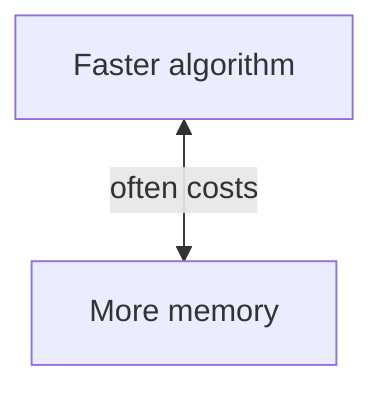

Most of the time, trading memory for speed is a good deal. Not always, though: on a device with little RAM, or with billions of items, O(1) memory can be the right choice.

## 8. The exponential trap: O(2ⁿ)

The textbook Fibonacci is a short and elegant recursive function (see [FibonacciExamples.cs](../../src/Algorithms/Foundations/FibonacciExamples.cs)):

```csharp
long Fib(int n) => n < 2 ? n : Fib(n - 1) + Fib(n - 2);
```

Every call makes two more calls, each of those makes two more, and many of them compute the same value again and again.

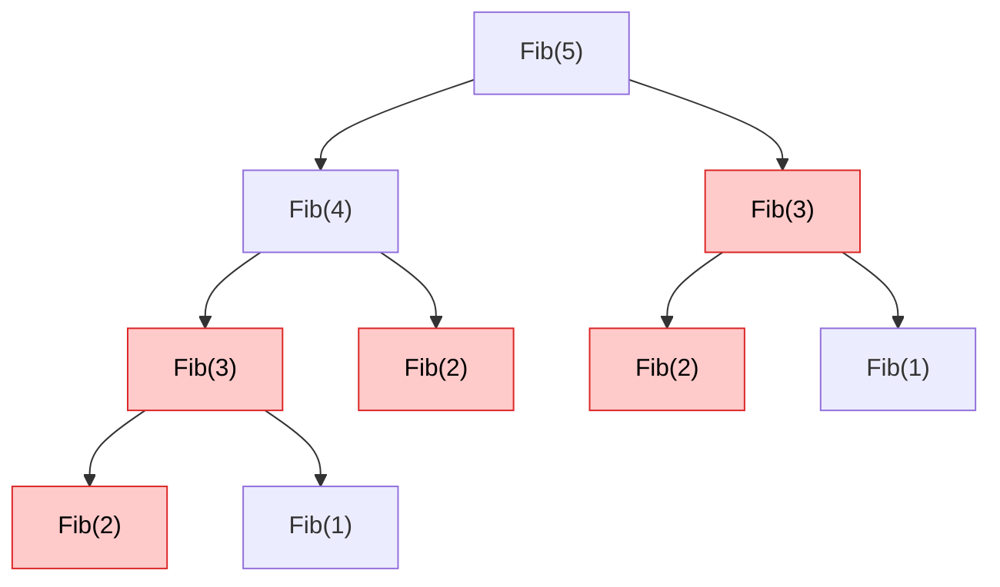

The tree is cut at `Fib(2)`, and it's already full of repeated work: the red calls compute values that are also computed somewhere else. The chart shows how the number of calls explodes (the tests check these exact numbers):

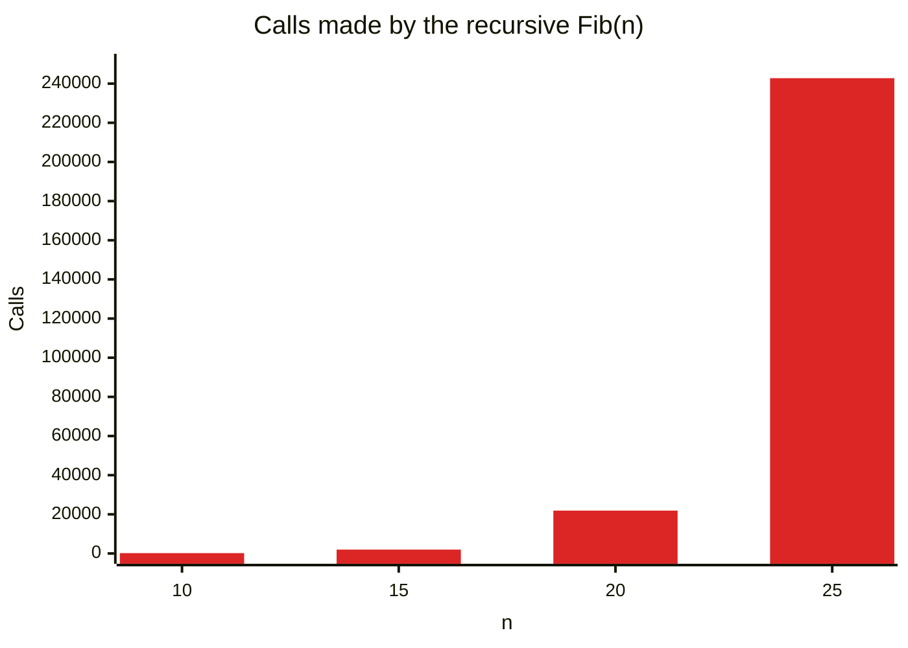

Adding just 5 to `n` multiplies the work by more than 10. The [iterative version](../../src/Algorithms/Foundations/FibonacciExamples.cs) computes the same values in O(n) by remembering the last two results. This idea, not recomputing what you already know, comes back in the dynamic programming lessons.

## 9. Worst case, average case and amortized cost

When we say that `List.Contains` is O(n), we mean the worst case, when the value is at the end of the list or isn't there at all. Sometimes it's found at the first position, but we plan for the worst.

There's one more idea you'll need later, the amortized cost. Look at `List<T>.Add`: a list keeps its items in an array with a fixed capacity, and when the array is full, `Add` creates a new one twice as big and copies everything into it.

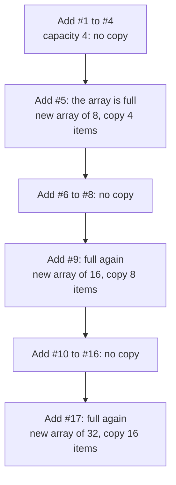

A single `Add` can be slow (O(n) when it copies), but copies are rare. After 17 adds only 4 + 8 + 16 = 28 items have been copied, less than 2 per add, so on average each `Add` costs O(1). That's what "amortized O(1)" means.

If you know in advance how many items you'll add, `new List<T>(capacity)` avoids the copies entirely.

## 10. Try it: measure it yourself

Seeing it is more convincing than reading about it. The [BigOExperiment](../../experiments/BigOExperiment/Program.cs) project searches 1,000 missing values in a `List` (O(n)) and in a `HashSet` (O(1) on average):

```bash
dotnet run -c Release --project experiments/BigOExperiment
```

These are the results on my machine:

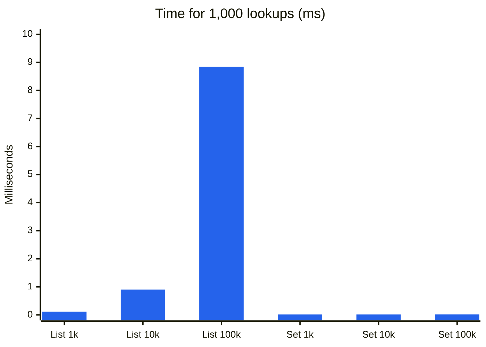

| Items   | List, O(n) | HashSet, O(1) |
|--------:|-----------:|--------------:|
| 1,000   | 0.117 ms   | 0.015 ms      |
| 10,000  | 0.902 ms   | 0.015 ms      |
| 100,000 | 8.841 ms   | 0.016 ms      |

Each time the list gets 10 times bigger, its time grows about 10 times, while the `HashSet` doesn't care. Your numbers will be different, but the shape will be the same, and that's exactly what Big-O predicts.

## 11. How to read the complexity tables in this course

Every lesson ends with a table like this one:

| Approach    | Time         | Space | Why                                      |
|-------------|--------------|-------|------------------------------------------|
| Brute force | O(n²)        | O(1)  | compares every pair                      |
| Optimized   | O(n) average | O(n)  | one pass, remembers seen values in a set |

Time and space are the worst case, unless the lesson says "average" or "amortized". Lookups in a `Dictionary` or a `HashSet` are O(1) on average and can be slower in rare cases, as [lesson 01](../01-two-sum/README.md#5-a-better-idea-remember-what-youve-seen) explains, which is why the algorithms built on them are marked "average".

`n` is the size of the input. When there are two inputs we use two letters, for example `O(n + m)`, or `O(n log k)` for "n items, keep the top k".

The "Why" column is the important one: if you understand the reason, you'll remember the complexity.

Other courses also use the symbols Ω (Omega) and Θ (Theta) for lower and exact bounds. They're useful in theory, but in practice, and in interviews, people say "Big-O" and mean the worst case, and this course does the same.

## Quick check

Try to answer each question before opening the solution.

**1.** You call `dictionary.ContainsKey(id)` inside a `foreach` over `n` orders. What's the total complexity?

<details>
<summary>Answer</summary>

O(n) on average: `n` iterations, each with an O(1) lookup on average.

</details>

**2.** Same loop, but with `list.Contains(id)` on a list of `n` customers. What changes?

<details>
<summary>Answer</summary>

It becomes O(n²): `n` iterations, each with an O(n) lookup. The code has the same shape, but a different data structure puts it in a completely different category.

</details>

**3.** An algorithm takes 1 second with 1,000 items and 4 seconds with 2,000. What's its complexity likely to be?

<details>
<summary>Answer</summary>

O(n²): doubling the input multiplied the time by 4, which is 2².

</details>

**4.** Is O(1) always faster than O(n)?

<details>
<summary>Answer</summary>

No. Big-O describes growth, not speed. An O(1) operation that takes 1 ms is slower than an O(n) loop over 10 items. Big-O tells you which one wins when n becomes large.

</details>

## Summary

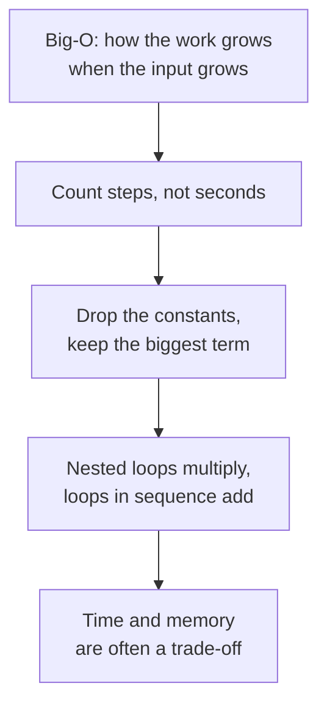

Next: [lesson 01, Two Sum and its variations](../01-two-sum/README.md), where a `Dictionary` turns an O(n²) search into O(n).
