# 00 — How to Measure an Algorithm: Big-O in Practice

| Difficulty | Module | Time |
|------------|--------|------|
| ★☆☆ Foundation | [0 — Foundations](../../README.md#module-0--foundations) | ~35 minutes |

**Prerequisites:** C# loops, `List<T>`, `Dictionary<TKey, TValue>`, `HashSet<T>`.

**You'll learn:**

- why "it's fast on my machine" is not enough
- how to estimate the cost of a piece of code by **counting steps**
- the 6 complexities used in this course, with C# code you already write every day
- how to read the complexity tables in the next lessons

> No formulas, no proofs. Just counting and a few pictures.

---

## 1. Why We Need It

Here's a method you could find in any business application. It checks whether two customers registered with the same email:

```csharp
bool HasDuplicateEmails(List<Customer> customers)
{
    for (var i = 0; i < customers.Count; i++)
        for (var j = i + 1; j < customers.Count; j++)    // compare every pair of customers
            if (customers[i].Email == customers[j].Email)
                return true;

    return false;
}
```

It's short, it's correct, and with 100 customers it answers instantly. Then the company grows, and the same method starts blocking the page for **minutes**.

The computer didn't get slower. **The amount of work grew much faster than the data.**

Big-O is a way to describe exactly that: **how the work grows when the input grows**.

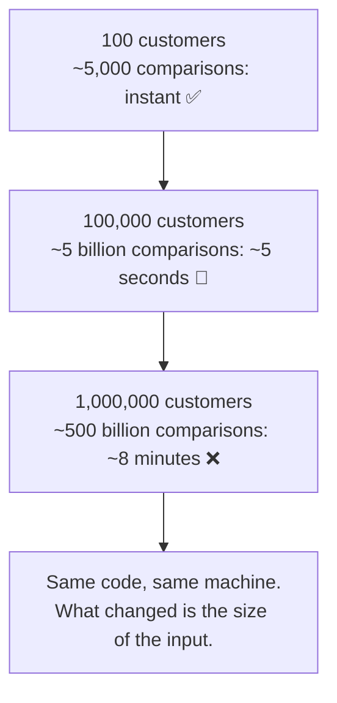

*(Times assume one comparison per nanosecond.)*

---

## 2. Count Steps, Not Seconds

Seconds depend on the machine, the CPU, what else is running. Steps don't.

Look at what `List<int>.Contains` does when the value is missing:

```csharp
var ids = new List<int> { 7, 3, 9, 4, 1 };
ids.Contains(8);   // compares 8 with 7, 3, 9, 4, 1 → 5 comparisons
```

It has no shortcut: it must check **every** item. With `n` items, it does `n` comparisons.

> [!TIP]
> That's all Big-O is: **"if the input has n items, roughly how many steps?"** We write it as O(*something*), and read it as "order of *something*".

`List.Contains` is **O(n)**: twice the items, twice the steps.

### ⏸️ Pause and think

A list has 1,000 items. How many comparisons does `Contains` do for a value that's not there? And with 2,000 items?

<details>
<summary>Answer</summary>

1,000 and 2,000. The steps grow at the same pace as the items: that's what O(n) means.

</details>

---

## 3. A Smarter Search: O(log n)

If the list is **sorted**, we can do much better. Think of looking up a word in a paper dictionary: you open it in the middle, see that your word comes later, and **throw away half the book**. Then you repeat.

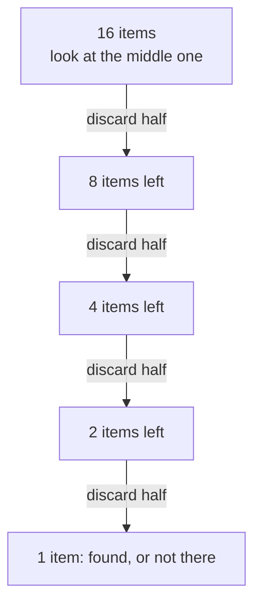

16 items, about 4–5 steps. That's **binary search**, and its cost is **O(log n)**: the number of times you can halve `n` before reaching 1.

You don't need to compute logarithms. Just remember how slowly they grow:

| Items (n)     | Linear search, O(n) | Binary search, O(log n) |
|---------------|--------------------:|------------------------:|
| 10            | 10                  | 4                       |
| 1,000         | 1,000               | 10                      |
| 1,000,000     | 1,000,000           | **20**                  |

The code is in [SearchExamples.cs](../../src/Algorithms/Foundations/SearchExamples.cs). Both methods return how many steps they took, and the [tests](../../tests/Algorithms.Tests/Foundations/SearchExamplesTests.cs) check these exact numbers.

### ⏸️ Pause and think

How many steps does binary search need for **1 billion** sorted items?

<details>
<summary>Answer</summary>

About **30**. Every 10 halvings divide the size by roughly 1,000 (2¹⁰ = 1,024), so 1,000,000,000 → 1,000,000 → 1,000 → 1 takes 3 × 10 = 30 steps.

</details>

---

## 4. Six Ways the Work Can Grow

You've already met O(n) and O(log n). The course uses four more. Here they are **one at a time**, each with a few lines of C# you probably write every week, and how much work it means for **1,000 items**.

### O(1) — constant

```csharp
var first = orders[0];                  // reading an array or list element by index
var customer = customersById[id];       // a Dictionary lookup (on average)
```

The work doesn't depend on the size: 10 orders or 10 million, it's the same. **1,000 items → 1 step.**

### O(log n) — logarithmic

```csharp
var index = sortedIds.BinarySearch(id); // halves the list at every step (section 3)
```

The work grows very slowly. **1,000 items → about 10 steps.**

### O(n) — linear

```csharp
decimal total = 0;
foreach (var order in orders)           // one step per order
    total += order.Amount;
```

Twice the items, twice the work. **1,000 items → 1,000 steps.**

### O(n log n) — "linearithmic"

```csharp
orders.Sort();                          // or: orders.OrderBy(o => o.Date)
```

Sorting costs a little more than reading every item once: `n` times `log n`. **1,000 items → about 10,000 steps.** How sorting works, and why it costs exactly this much, is explained in [Appendix E](../../appendix/E-how-sorting-works.md).

### O(n²) — quadratic

```csharp
foreach (var a in customers)
    foreach (var b in customers)        // for each customer, look at every customer again
        Compare(a, b);
```

A loop inside a loop over the same data: `n × n`. **1,000 items → 1,000,000 steps.** The `HasDuplicateEmails` of section 1 has the same shape: it skips the pairs it has already compared, so it does about n²/2 steps, but that's still O(n²), as [section 6](#6-two-rules-to-calculate-it-yourself) explains.

### O(2ⁿ) — exponential

```csharp
long Fib(int n) => n < 2 ? n : Fib(n - 1) + Fib(n - 2);   // every call makes two more calls
```

Every time `n` grows by one, the work (roughly) **doubles**. It's typical of "try every combination" solutions: with 1,000 items there are 2¹⁰⁰⁰ combinations, **a number with 302 digits: it never finishes.** Section 8 takes this one apart.

### ⏸️ Pause and think

Which of the six is this code?

```csharp
var romans = customers.Where(c => c.City == "Rome").ToList();
```

<details>
<summary>Answer</summary>

**O(n)**: `Where` checks the condition on every customer once. LINQ hides the loop, but the loop is still there.

</details>

### Putting them together

Here are the six side by side, from best to worst:

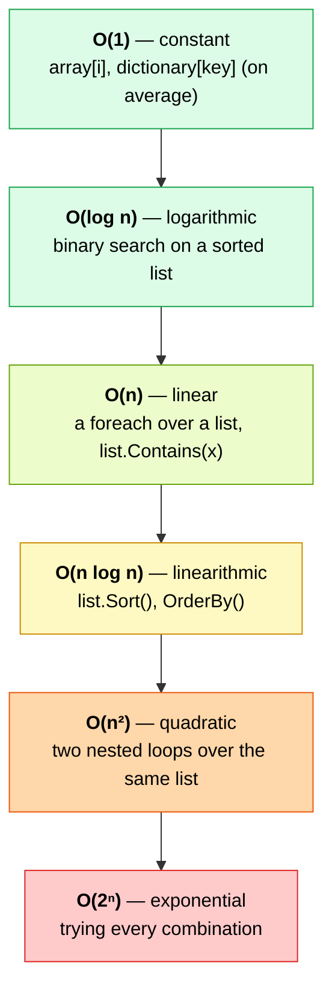

What they mean in practice, if one step took 1 nanosecond:

| Complexity | n = 10 | n = 1,000 | n = 1,000,000 | Time for n = 1,000,000 |
|------------|-------:|----------:|--------------:|-----------------------:|
| O(1)       | 1      | 1         | 1             | instant                |
| O(log n)   | 4      | 10        | 20            | instant                |
| O(n)       | 10     | 1,000     | 1,000,000     | 1 ms                   |
| O(n log n) | 33     | 10,000    | 20,000,000    | 20 ms                  |
| O(n²)      | 100    | 1,000,000 | 10¹²          | **17 minutes**         |
| O(2ⁿ)      | 1,024  | a 302-digit number | — | **never finishes**     |

> [!IMPORTANT]
> With small inputs, everything looks fast. Big-O matters because **real data grows**.

### How fast does O(n²) run away?

The blue line is O(n), the red one is O(n²). With just 10 items, the quadratic code already does 10 times more work, and the gap keeps widening.

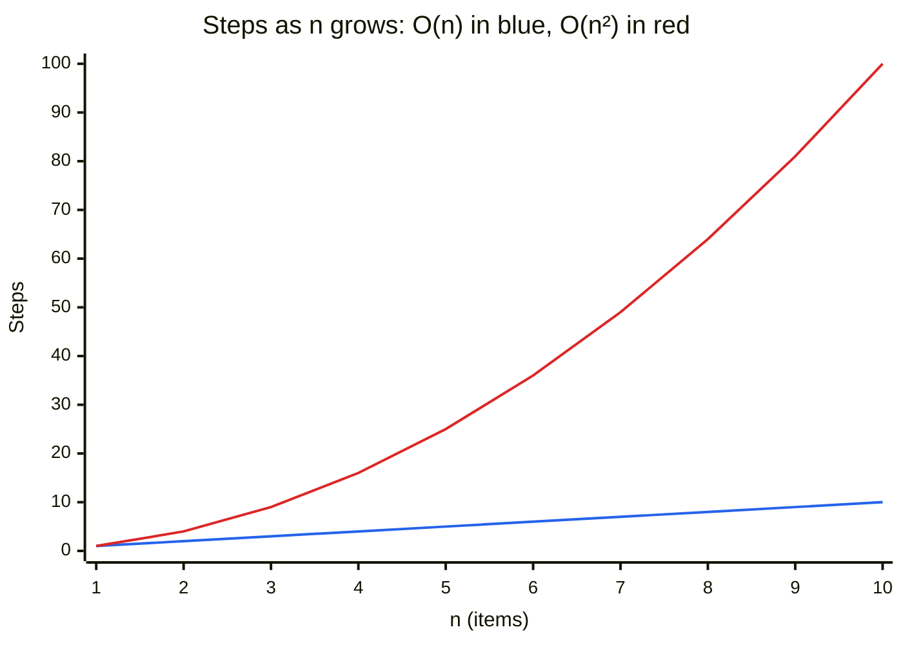

---

## 5. A Real Example: Finding Duplicates

The same question, answered in two ways ([DuplicateExamples.cs](../../src/Algorithms/Foundations/DuplicateExamples.cs)):

```csharp
// Version 1: compare every pair → O(n²)
for (var i = 0; i < items.Count; i++)
    for (var j = i + 1; j < items.Count; j++)
        if (items[i] == items[j]) return true;

// Version 2: remember what you've seen → O(n)
var seen = new HashSet<int>();
foreach (var item in items)
    if (!seen.Add(item)) return true;
```

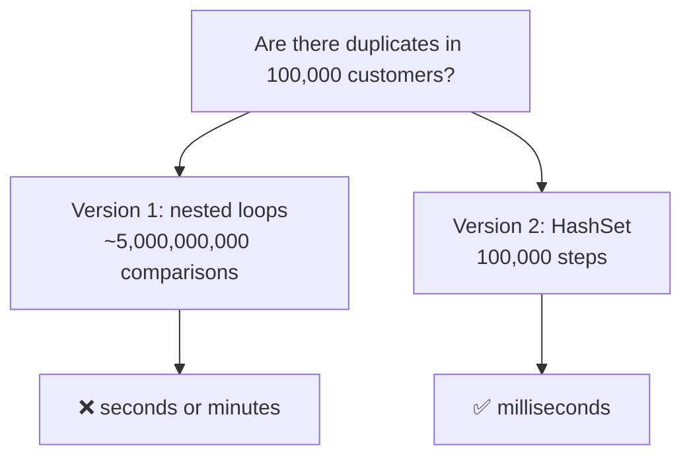

Version 2 isn't "slightly faster". It's in a **different category**: the gap grows with every customer you add.

📌 **In a nutshell:** a loop inside a loop over the same data is the most common source of O(n²). When you see one, ask yourself: *can a `HashSet` or a `Dictionary` remember what I need?*

---

## 6. Two Rules to Calculate It Yourself

You don't need to count every single step. Two rules are enough.

### Rule 1: drop the constants

```csharp
foreach (var x in items) Sum(x);       // n steps
foreach (var x in items) Print(x);     // n more steps
```

That's `2n` steps, but we write **O(n)**. Doubling the input still doubles the time: the shape of the growth is the same.

### Rule 2: keep only the biggest term

```csharp
foreach (var x in items) Print(x);     // n steps
foreach (var x in items)
    foreach (var y in items) Compare(x, y);   // n × n steps
```

That's `n² + n` steps, but we write **O(n²)**. With a million items, `n²` is a trillion and `n` is a million: the second term doesn't matter.

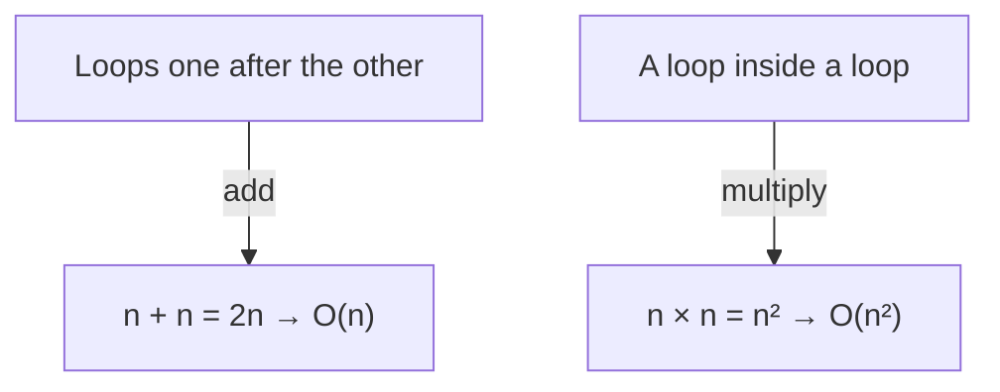

### ⏸️ Pause and think

What's the complexity of this method?

```csharp
void Report(List<Order> orders)
{
    orders.Sort();                          // ?
    foreach (var order in orders)           // ?
        Console.WriteLine(order);
}
```

<details>
<summary>Answer</summary>

`Sort()` is O(n log n), the loop is O(n). They run one after the other, so we add them: O(n log n + n). Keeping the biggest term: **O(n log n)**.

</details>

---

## 7. Memory Counts Too: Space Complexity

Big-O also describes **how much extra memory** an algorithm needs. The two duplicate checkers make a classic trade-off:

| Version       | Time   | Extra memory | Why                                  |
|---------------|--------|--------------|--------------------------------------|
| Nested loops  | O(n²)  | **O(1)**     | only two index variables             |
| HashSet       | O(n) average | **O(n)** | the set can hold up to n items |

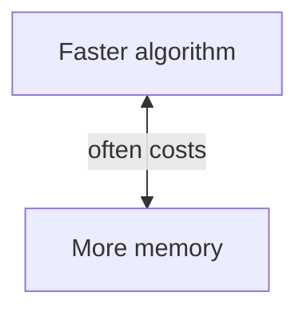

Most of the time, trading memory for speed is a great deal. But not always: on a device with little RAM, or with billions of items, O(1) memory can be the right choice.

---

## 8. The Exponential Trap: O(2ⁿ)

The textbook Fibonacci is a short, elegant recursive function ([FibonacciExamples.cs](../../src/Algorithms/Foundations/FibonacciExamples.cs)):

```csharp
long Fib(int n) => n < 2 ? n : Fib(n - 1) + Fib(n - 2);
```

Every call makes **two** more calls, which make two more each... and many of them compute the same value again and again.

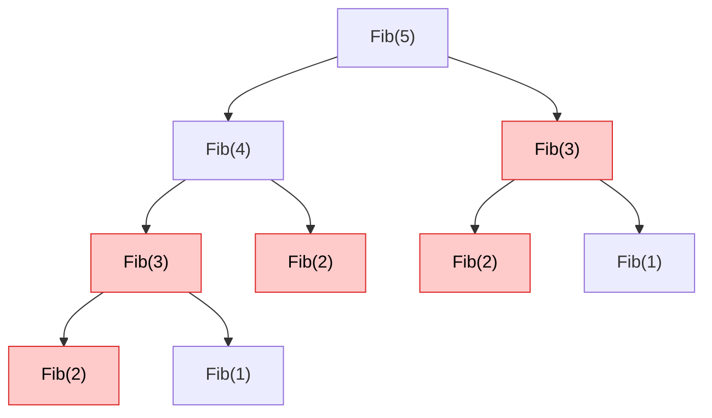

The tree is cut at `Fib(2)`, and it's already full of **repeated work**: the red calls compute values that are computed elsewhere too. Here's how the number of calls explodes (these exact numbers are checked by the tests):

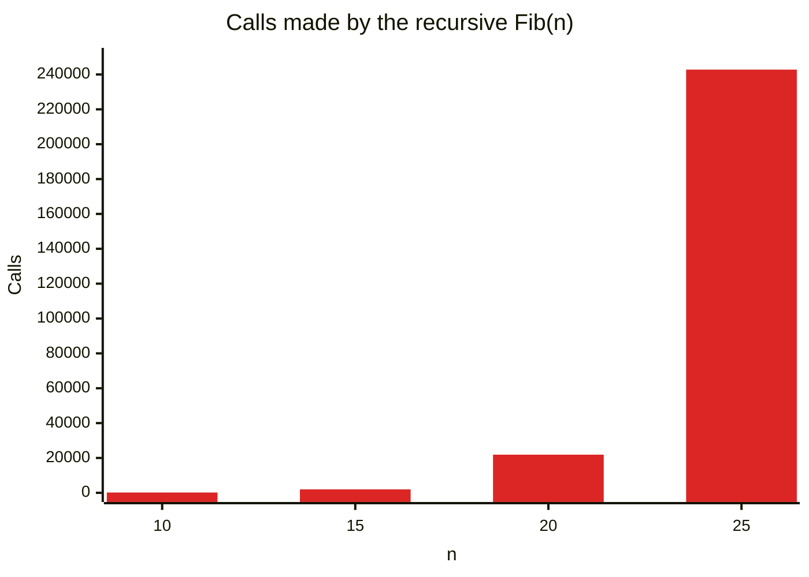

Adding just 5 to `n` multiplies the work by more than 10. The [iterative version](../../src/Algorithms/Foundations/FibonacciExamples.cs) computes the same values in **O(n)** by remembering the last two results. You'll see this idea, *don't recompute what you already know*, again in the Dynamic Programming lessons.

---

## 9. Average vs Worst Case, and "Amortized" Cost

When we say `List.Contains` is O(n), we mean the **worst case**: the value is at the end or not there at all. Sometimes it's found at the first position, but we plan for the worst.

There's one more idea you'll need later: **amortized cost**. Look at `List<T>.Add`. A list stores its items in an array with a fixed **capacity**. When the array is full, `Add` creates a bigger one (twice the size) and copies everything:

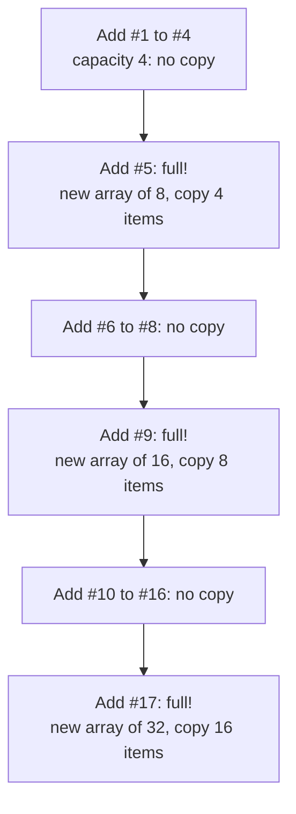

A single `Add` can be slow (O(n), when it copies), but copies are rare: after 17 adds, only 4 + 8 + 16 = 28 items were copied, **less than 2 per add**. On average, each `Add` costs O(1). That's what **amortized O(1)** means.

> [!TIP]
> If you know how many items you'll add, `new List<T>(capacity)` avoids the copies entirely.

---

## 10. 🧪 Try It: Measure It Yourself

Seeing is believing. The [BigOExperiment](../../experiments/BigOExperiment/Program.cs) project searches 1,000 missing values in a `List` (O(n)) and in a `HashSet` (O(1) on average):

```bash
dotnet run -c Release --project experiments/BigOExperiment
```

Results on my machine:

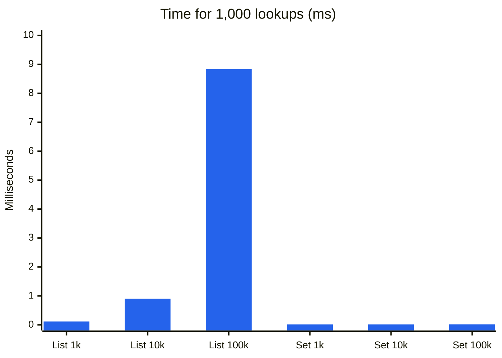

| Items   | List (O(n)) | HashSet (O(1)) |
|--------:|------------:|---------------:|
| 1,000   | 0.117 ms    | 0.015 ms       |
| 10,000  | 0.902 ms    | 0.015 ms       |
| 100,000 | 8.841 ms    | 0.016 ms       |

Each time the list gets 10 times bigger, its time grows about 10 times. The `HashSet` doesn't care. Your numbers will differ, but **the shape will be the same**: that's exactly what Big-O predicts.

---

## 11. How to Read the Complexity Tables in This Course

Every lesson ends with a table like this one:

| Approach    | Time        | Space | Why                                        |
|-------------|-------------|-------|--------------------------------------------|
| Brute force | O(n²)       | O(1)  | compares every pair                        |
| Optimized   | O(n) average | O(n) | one pass, remembers seen values in a set   |

- **Time** and **Space** are the worst case, unless the lesson says "average" or "amortized".
- Lookups in a `Dictionary` or a `HashSet` are **O(1) on average**: in rare cases they can be slower, as [lesson 01](../01-two-sum/README.md#5-the-better-idea-remember-what-youve-seen) explains. That's why algorithms built on them are marked "average".
- **n** is the size of the input. When there are two inputs, we use two letters (e.g. `O(n + m)`, or `O(n log k)` for "n items, keep the top k").
- The **Why** column is the important one: if you understand the reason, you'll remember the complexity.

> [!NOTE]
> Other courses use the symbols **Ω (Omega)** and **Θ (Theta)** for lower and exact bounds. They're useful in theory, but in practice, and in interviews, people say "Big-O" and mean the worst case. That's what this course does too.

---

## 🧠 Quick Check

Try to answer before opening each solution.

**1.** You call `dictionary.ContainsKey(id)` inside a `foreach` over `n` orders. What's the total complexity?

<details>
<summary>Answer</summary>

**O(n) on average**: `n` iterations × O(1) average per lookup.

</details>

**2.** Same loop, but with `list.Contains(id)` on a list of `n` customers. And now?

<details>
<summary>Answer</summary>

**O(n²)**: `n` iterations × O(n) per lookup. Same code shape, different data structure, a completely different category.

</details>

**3.** An algorithm takes 1 second with 1,000 items and 4 seconds with 2,000. What's its complexity likely to be?

<details>
<summary>Answer</summary>

**O(n²)**: doubling the input multiplied the time by 4 = 2².

</details>

**4.** Is O(1) always faster than O(n)?

<details>
<summary>Answer</summary>

**No.** Big-O describes *growth*, not speed. An O(1) operation that takes 1 ms is slower than an O(n) loop over 10 items. Big-O tells you which one wins **when n becomes large**.

</details>

---

## 📌 Summary

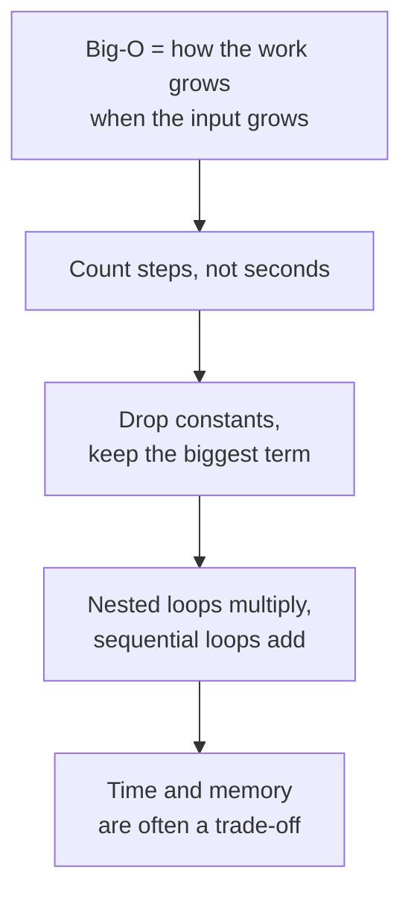

**Next:** [Lesson 01 — Two Sum and its variations](../../README.md#-syllabus), where a `Dictionary` turns an O(n²) search into O(n).
