# Lesson 01: Two Sum and its variations

| Difficulty | Module | Time |
|------------|--------|------|
| ★☆☆ Foundation (sections 1 to 5) → ★★☆ Intermediate (sections 6 to 8) | [Module 1: Arrays, hashing and two pointers](../../README.md#module-1-arrays-hashing-and-two-pointers) | about 40 minutes |

**Prerequisites:** [lesson 00 on Big-O](../00-big-o/README.md), `Dictionary<TKey, TValue>`, sorting.

This lesson shows how a `Dictionary` turns an O(n²) search into O(n) by remembering what you've already seen. Then, on sorted data, we'll use the two pointers technique and see why it never misses a solution. We'll extend the idea from two numbers to three and then to any number `k`, and see how a small change in the requirements can make the problem much harder. Along the way you'll also learn how to test a fast algorithm against a slow one that is obviously correct.

## 1. The problem

You work on the accounting software of a small company. A bank transfer of 1,250.00 EUR has just arrived, without the invoice numbers in the reference. The customer emails the accounting team to say that the payment settles two of their invoices, but doesn't say which ones. These are the customer's open invoices:

| Invoice | Amount     |
|---------|-----------:|
| INV-1   | 310.00 EUR |
| INV-2   | 475.00 EUR |
| INV-3   | 820.00 EUR |
| INV-4   | 155.00 EUR |
| INV-5   | 430.00 EUR |

Which two invoices does the transfer pay?

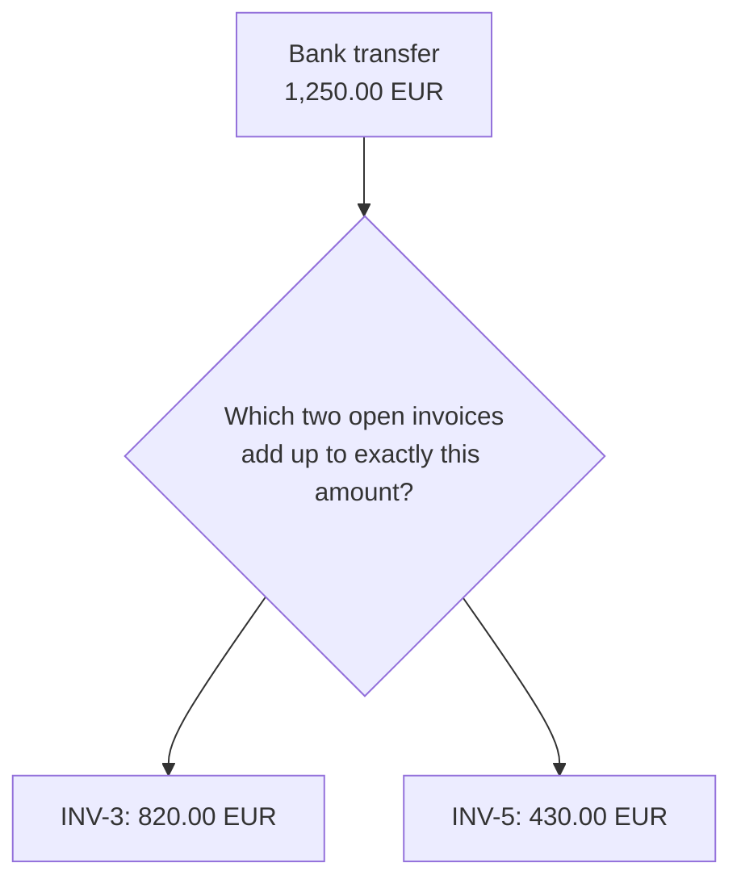

Stated in general terms: given a list of amounts and a target, find two different items whose sum is exactly the target, and return their positions. If no such pair exists, say so.

The code stores amounts in cents, so 1,250.00 EUR becomes the `int` `125000`. Money should never live in a `double`: in C#, `0.1 + 0.2 == 0.3` is false, and with `double` amounts this very algorithm can miss a pair that exists. Integer cents are exact, and they're also what you'll find in interview problems. [Appendix A](../../appendix/A-money-in-code.md) shows the bug in action, compares `double`, `decimal` and cents, and explains rounding and how to split an amount without losing a cent.

## 2. Before you start

Before writing any code, it's worth asking yourself (or the interviewer) a few questions. Here are the answers for our problem:

| Question | Answer |
|----------|--------|
| How many invoices does the payment settle? | Exactly two, as the customer told us. Section 8 shows what changes otherwise. |
| Can the same invoice be used twice? | No, the two items must be different. |
| Can two invoices have the same amount? | Yes: with two invoices of 300, 300 + 300 = 600 is a valid answer. |
| Can amounts be negative? | Yes, credit notes are negative. |
| What if several pairs match? | The algorithm returns one of them. In real reconciliation, several matches mean the payment is ambiguous and a person should check it (see exercise 2). |
| What if none matches? | Return `null`. |
| Is the list sorted? | Not in general. We'll see both cases. |

## 3. Think first

Before reading the solution, try to write it yourself. Your task is to write a method that receives the amounts of the open invoices and the amount of the payment, and returns the positions of the two invoices that add up to the payment, or `null` if there are none.

```csharp
// amounts: the open invoices, in cents. target: the payment, in cents.
(int First, int Second)? FindPair(int[] amounts, int target)
```

| Input | Expected output |
|-------|-----------------|
| `amounts = [31000, 47500, 82000, 15500, 43000]`, `target = 125000` | `(2, 4)`, that is INV-3 and INV-5 |
| `amounts = [31000, 47500]`, `target = 100000` | `null` |
| `amounts = [30000]`, `target = 60000` | `null`, because the same invoice can't be used twice |

Work on paper or in a small console app, with two goals, one at a time:

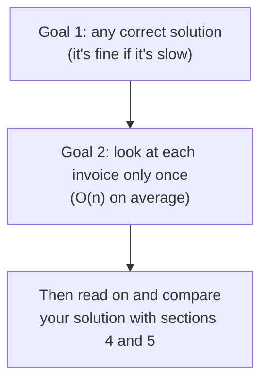

If you're stuck on the second goal, open the hints one at a time.

<details>
<summary>Hint 1</summary>

Pick one invoice, say the one for 820.00. Which amount would you need to find to reach 1,250.00?

</details>

<details>
<summary>Hint 2</summary>

You need `target - amount`, so the question becomes "is that missing amount somewhere in the list?". Which data structure answers "is X in here?" in O(1)?

</details>

## 4. The brute-force solution

The obvious solution tries every pair. It has the same shape as the duplicate check of lesson 00:

```csharp
for (var i = 0; i < amounts.Count; i++)
    for (var j = i + 1; j < amounts.Count; j++)
        if ((long)amounts[i] + amounts[j] == target)   // long: see "Common mistakes"
            return new PairResult(i, j);
```

It's simple and correct, but with `n` invoices it checks up to n × (n - 1) / 2 pairs, so it's O(n²).

| Open invoices | Pairs to check |
|--------------:|---------------:|
| 10            | 45             |
| 1,000         | 499,500        |
| 100,000       | about 5 billion |

Five invoices are no problem. But when the bank can't tell us who sent the money, we have to search the open invoices of every customer, and with 100,000 of them each unidentified transfer would take seconds.

## 5. A better idea: remember what you've seen

Instead of comparing every pair, we can walk through the invoices once. For each amount we compute what's missing to reach the payment (`target - amount`) and check whether we've already seen it. A dictionary answers that question quickly.

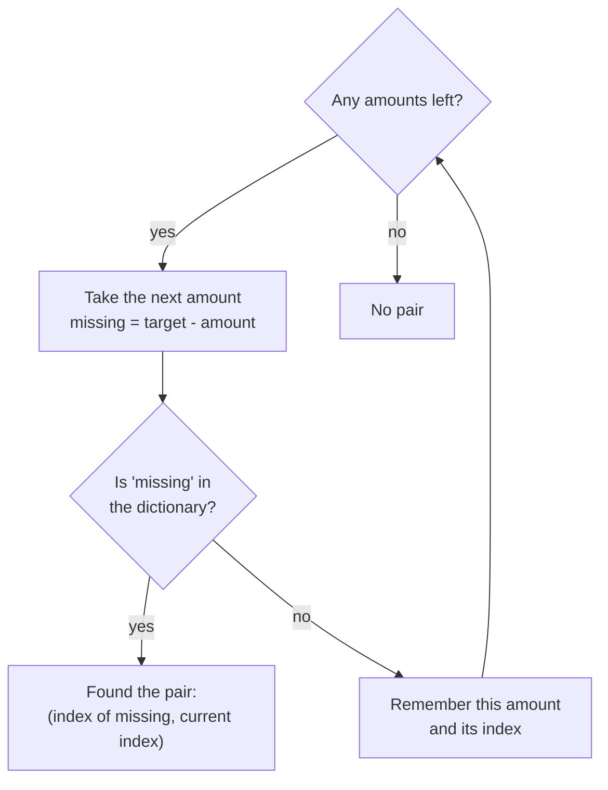

Here's the trace for the 1,250.00 EUR transfer:

| Step | Amount | Missing  | Seen so far   | Result |
|-----:|-------:|---------:|---------------|--------|
| 1    | 310.00 | 940.00   |               | not seen, remember 310.00 |
| 2    | 475.00 | 775.00   | 310           | not seen, remember 475.00 |
| 3    | 820.00 | 430.00   | 310, 475      | not seen, remember 820.00 |
| 4    | 155.00 | 1,095.00 | 310, 475, 820 | not seen, remember 155.00 |
| 5    | 430.00 | 820.00   | 310, 475, 820, 155 | seen: INV-3 and INV-5 |

One pass with one dictionary lookup per invoice: O(n) time, plus O(n) memory for the dictionary.

To be precise, a dictionary lookup is O(1) on average. In the worst case, if many keys end up in the same internal bucket (a hash collision), a lookup can cost O(n). With integer keys and .NET's `Dictionary` this practically never happens, so we say the dictionary version is O(n) on average and O(n²) in the theoretical worst case. You'll see the same convention in the complexity tables of the whole course.

### Stop and think

In the loop we first look up the missing amount, then add the current one to the dictionary. What would go wrong if we did it the other way around?

<details>
<summary>Answer</summary>

An item could be paired with itself. With a single invoice of 300.00 and a payment of 600.00, we'd add 300.00, then look for 300.00 and find it: a wrong match. Checking first guarantees that the dictionary only contains the other items.

</details>

### How big is the difference?

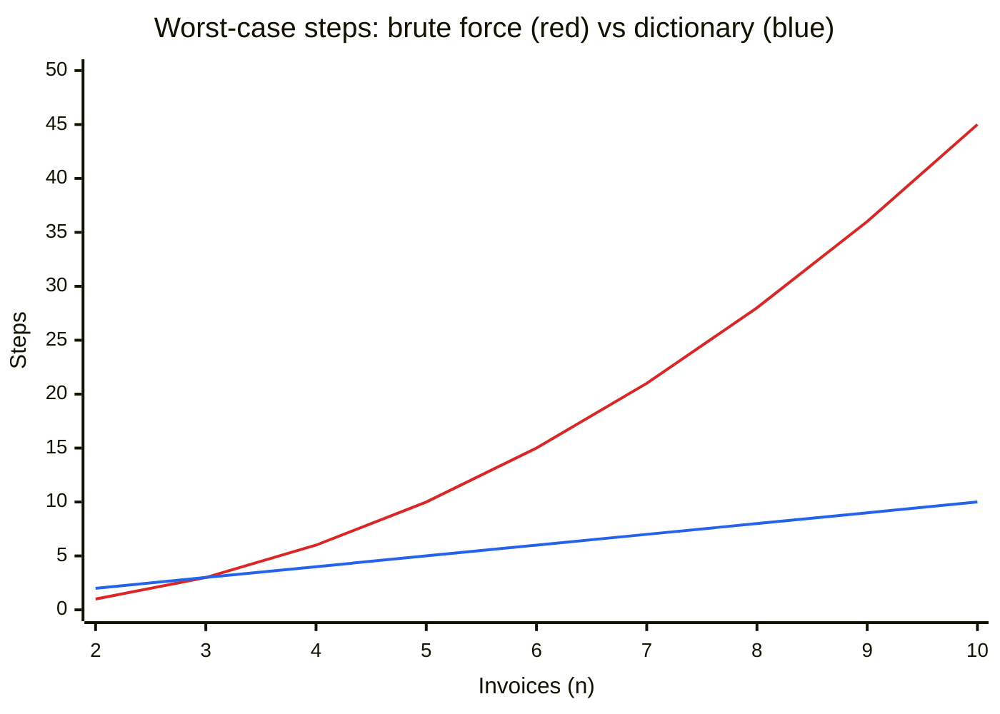

The [tests](../../tests/Algorithms.Tests/Arrays/TwoSumTests.cs) check the exact numbers: with 1,000 invoices and no matching pair, the brute force takes 499,500 steps and the dictionary 1,000.

In short: don't search for the partner of each item, remember the items you've already met and look the partner up.

## 6. Variation: the list is already sorted

Suppose the invoices come from a database query with `ORDER BY amount`. In that case we can avoid the dictionary and its O(n) memory, using two pointers: one starts on the smallest amount, the other on the largest.

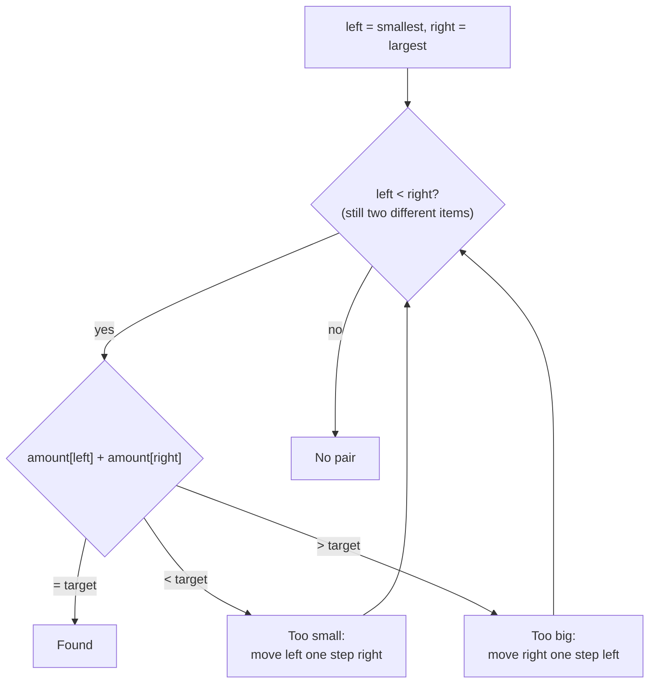

Here's the trace with the sorted invoices and a transfer of 905.00 EUR:

| Step | Left   | Right  | Sum    | Decision |
|-----:|-------:|-------:|-------:|----------|
| 1    | 155.00 | 820.00 | 975.00 | too big, move right |
| 2    | 155.00 | 475.00 | 630.00 | too small, move left |
| 3    | 310.00 | 475.00 | 785.00 | too small, move left |
| 4    | 430.00 | 475.00 | 905.00 | found |

Every step discards one item, so there are at most `n - 1` steps: O(n) time and O(1) memory.

### Stop and think

At step 1 the sum is too big, and we discard 820.00 for good. How can we be sure that 820.00 isn't part of the answer together with some other invoice?

<details>
<summary>Answer</summary>

820.00 was paired with 155.00, the smallest amount still available, and the sum was already too big. Any other partner is larger than 155.00, so the sum would only get bigger: 820.00 can't be part of the answer, and it's safe to drop it.

The same reasoning works the other way round. If the sum is too small even with the largest partner available, the left item can't reach the target with anyone.

</details>

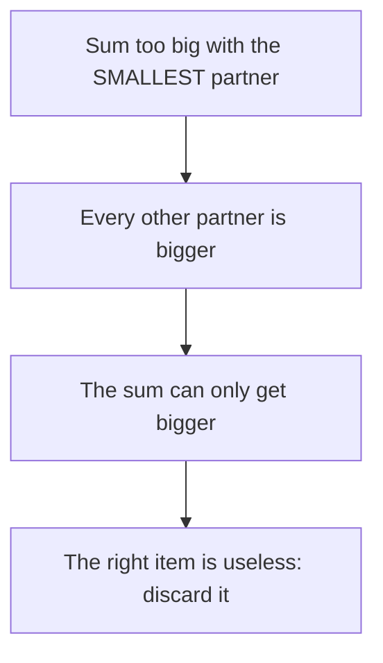

In short: on sorted data, every comparison tells you which item can never be part of the answer, so you can throw it away.

One warning: two pointers returns positions in the sorted list. If the input isn't sorted and you need the original positions, sorting costs O(n log n) and you also have to remember where each item came from. In that case the dictionary is simpler and faster.

## 7. From two to three: 3Sum

A new request comes from the accounting team: in the ledger, they want every group of three entries that balance to zero, for example two refunds and one charge.

```
Ledger entries (EUR): -100, 0, 100, 200, -100, -400
```

The idea is to sort the entries, fix the first entry of the group, and search the other two with two pointers exactly as before.

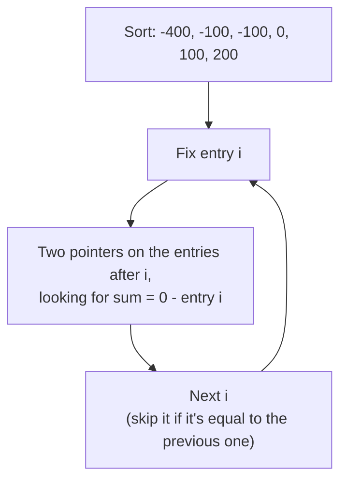

The result is (-100, -100, 200) and (-100, 0, 100).

For each of the `n` fixed entries we run an O(n) two-pointer search, which gives O(n²) in total, instead of O(n³) for trying every triple.

### Stop and think

The sorted list contains -100 twice. Why does the code skip the second -100 when it's the fixed entry?

<details>
<summary>Answer</summary>

Fixing the first -100 already finds every triple that starts with -100. Fixing the second one would find (-100, 0, 100) again, a duplicate. Skipping equal values, both for the fixed entry and for the two pointers after a match, is what makes every triple appear only once.

</details>

The code is in [ThreeSum.cs](../../src/Algorithms/Arrays/ThreeSum.cs).

## 8. Any number: k-Sum

The same trick works for any `k`: fix one value, and solve the problem for `k - 1` values on the rest. Repeat until only two values are left, then use two pointers.

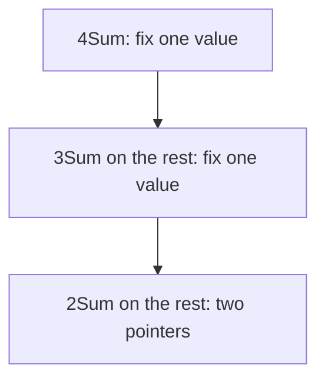

Every level adds a loop over `n` values, so for k ≥ 3 k-Sum costs O(n^(k-1)): O(n²) for 3Sum, O(n³) for 4Sum. For k = 2 the search itself is O(n), but the method sorts the input first, so the total is O(n log n). In [KSum.cs](../../src/Algorithms/Arrays/KSum.cs) the recursion and the duplicate skipping are the same ideas as 3Sum, written once for every `k`.

### Stop and think: what if we don't know how many invoices?

So far the customer told us how many invoices the payment settles. In real life that often isn't the case: a transfer can pay one invoice, two, five, or only part of one. Look at how much the difficulty changes because of this single detail:

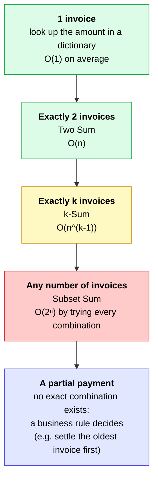

With any number of invoices, every invoice can be in or out of the combination, which gives 2ⁿ possibilities: the exponential growth of [lesson 00](../00-big-o/README.md#8-the-exponential-trap-o2ⁿ). With 30 open invoices that's over a billion combinations. No known algorithm solves this problem fast in every case, but when the amounts are non-negative integers (like cents) and the target isn't huge, dynamic programming solves it in O(n × target). You'll meet that idea in Module 6.

So "exactly two" isn't a detail: knowing how many items you're looking for is what makes the problem easy.

## 9. Complexity

| Approach                       | Time         | Extra space | Why |
|--------------------------------|--------------|-------------|-----|
| Two Sum, brute force           | O(n²)        | O(1)        | tries every pair |
| Two Sum, dictionary            | O(n) average | O(n)        | one pass, O(1) average lookup per item |
| Two Sum, two pointers (sorted) | O(n)         | O(1)        | each step discards one item; the input is already sorted |
| 3Sum, sort and two pointers    | O(n²)        | O(n)        | n fixed values × O(n) search, plus a sorted copy |
| k-Sum (k ≥ 3), sort and recursion | O(n^(k-1)) | O(n)      | one loop per extra value |

The space column doesn't count the output, since 3Sum and k-Sum can return many combinations.

## 10. Edge cases and tests

All of these cases are covered by the [tests](../../tests/Algorithms.Tests/Arrays/):

| Case | Example | Expected |
|------|---------|----------|
| Two equal amounts | `[300, 300]`, target 600 | found |
| The same item twice | `[300, 500]`, target 600 | not found |
| No match, empty list, one item | `[]`, `[100]` | `null` |
| Negative amounts (credit notes) | `[-2000, 15000, 7000]`, target 5000 | found |
| Overflow | `[int.MaxValue, int.MaxValue]`, target -2 | not found |
| Repeated values in 3Sum | `[0, 0, 0, 0, 0]`, target 0 | `(0, 0, 0)` only once |

### A testing technique worth stealing

How do you know the fast version is right on inputs you didn't think of? You can compare it with the brute force on hundreds of random inputs. The brute force is slow but obviously correct, so it works as a referee:

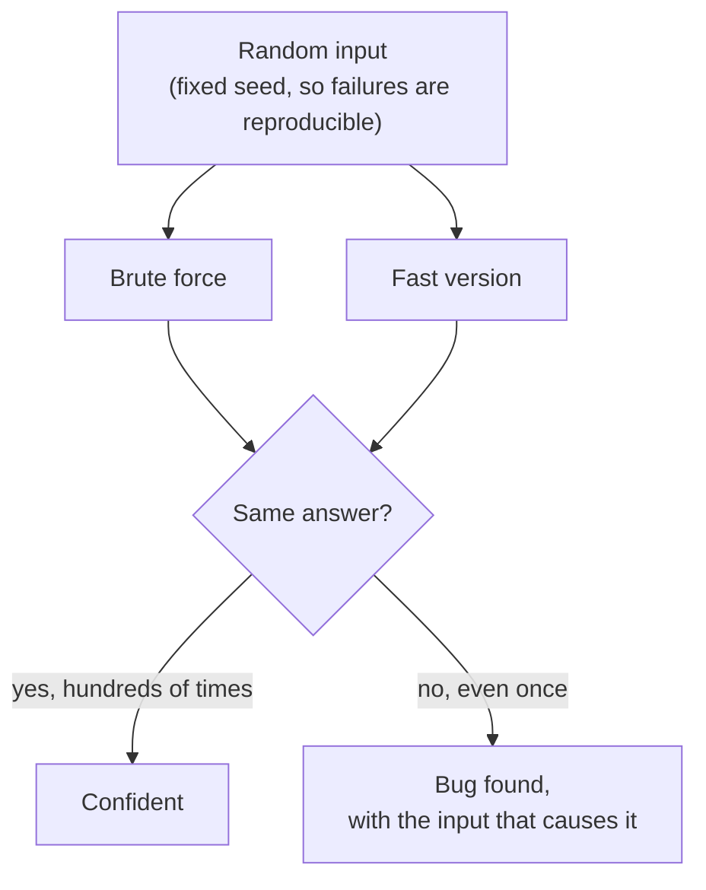

The tests do this for Two Sum (500 random inputs), 3Sum (300) and 4Sum (200).

## 11. Common mistakes

| Mistake | What happens | Fix |
|---------|--------------|-----|
| Adding the current item to the dictionary before checking | An item pairs with itself: `[300]` "solves" target 600 | Check first, then add |
| Summing two `int`s | `int.MaxValue + int.MaxValue` wraps around to -2, a false match | Cast to `long` before adding |
| Using two pointers on unsorted data | It skips valid pairs | Sort first, or use the dictionary |
| Returning indices of the sorted copy | The positions don't match the original list | Use the dictionary, or keep the original indices |
| Not skipping duplicates in 3Sum | The same triple is returned twice | Skip equal values for the fixed item and after a match |

## 12. In .NET

`Dictionary.TryGetValue` does the lookup and returns the value with a single search, while `ContainsKey` followed by `dict[key]` searches twice. `Dictionary.TryAdd` adds a key only if it's missing, so here it keeps the first index when an amount appears twice.

When you only need to know whether a pair exists, and not where it is, a `HashSet<T>` is enough.

To sort, `Enumerable.Order()` (from .NET 7) and `Array.Sort` both take O(n log n). [Appendix E](../../appendix/E-how-sorting-works.md) explains where that cost comes from, and why `Array.Sort` and `OrderBy` don't treat equal items the same way.

## 13. Practice

1. ★ Return the invoice codes (`INV-3`, `INV-5`) instead of the indices, using a `record Invoice(string Code, int AmountInCents)`.
2. ★★ Count how many different pairs add up to the target. With `[300, 300, 300]` and target 600 the answer is 3. In the reconciliation scenario, any count above 1 means the payment is ambiguous.
3. ★★ On sorted data, find the pair whose sum is closest to the target when there's no exact match. Hint: use two pointers and remember the best sum you've seen.
4. ★★★ Check whether a 4Sum exists in O(n²) on average. Store the sums of all pairs in a dictionary, then look for two pairs that complete each other, making sure they don't share an item. Why does listing all the unique combinations this way get much harder?

## Quick check

**1.** The list is unsorted, you need the original positions, and memory isn't a problem. Which approach would you use?

<details>
<summary>Answer</summary>

The dictionary: it's O(n) on average and works directly on the original positions.

</details>

**2.** The list is sorted, it has 100 million items, and you're short on memory. Which approach would you use?

<details>
<summary>Answer</summary>

Two pointers. It takes O(n) time like the dictionary, but only O(1) extra memory instead of a dictionary with up to 100 million entries.

</details>

**3.** What's the complexity of 5Sum with the method of section 8?

<details>
<summary>Answer</summary>

O(n⁴): k - 1 = 4 nested levels of work over `n` values.

</details>

**4.** Why does the code compute `(long)amounts[i] + amounts[j]` instead of `amounts[i] + amounts[j]`?

<details>
<summary>Answer</summary>

Two large `int`s can overflow and wrap around to a completely different number, which could even match the target by accident. Converting to `long` first makes the sum exact.

</details>

## Summary

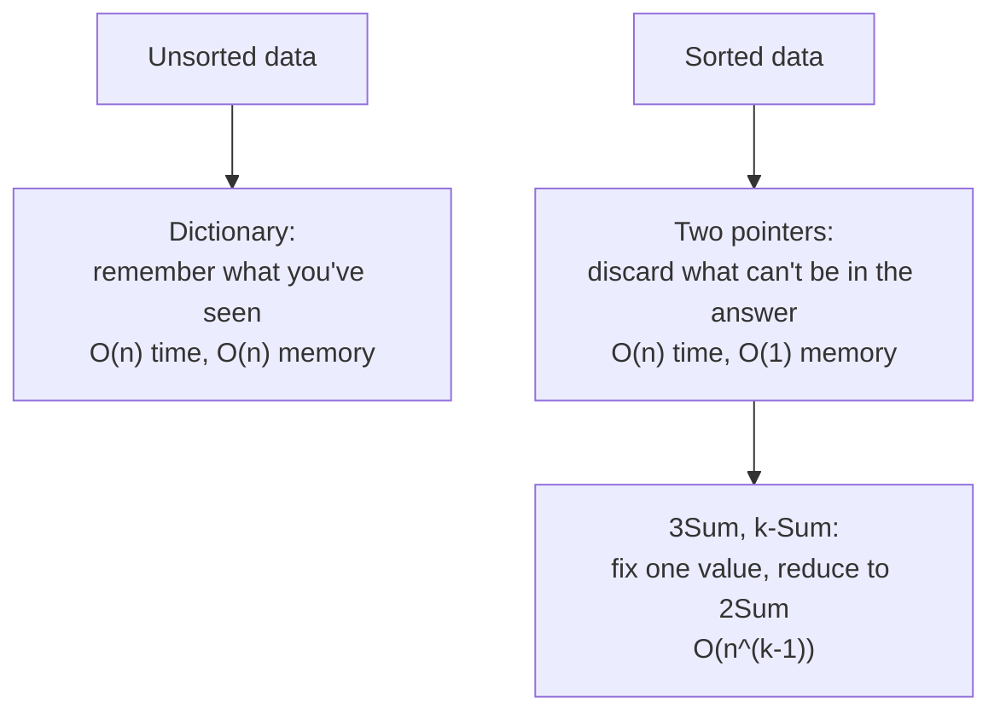

Next: lesson 02, maximum subarray sum, where a single pass with the right running value solves a problem that seems to need every subarray. It's [in the syllabus](../../README.md#syllabus) and coming soon.
